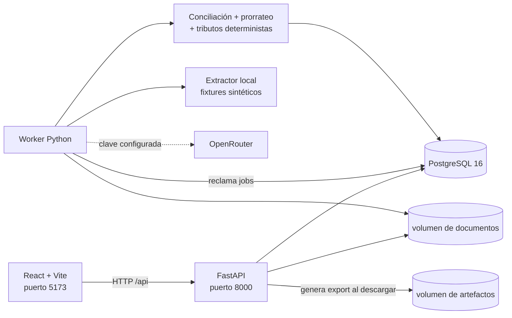

# Automatización de despachos aduaneros

Motor diseñado para configurarse por país que recibe los documentos de una importación, los
clasifica y extrae, los contrasta entre sí, calcula el prorrateo y los tributos, y entrega un
Excel de conciliación y un borrador de declaración para que una persona revise y apruebe.

## A quién se le vende y quién usa qué

Hay tres niveles y conviene no confundirlos:

| Nivel | Quién es | Rol en el sistema |
|---|---|---|
| **Sistema** | Este producto | Motor único, configurable por jurisdicción y por cliente |
| **Agencia de aduanas** | **El cliente que paga.** Tramita despachos por cuenta de terceros | Es la *organización* (`org_id`). Hoy tiene configuración y marca propias; identidad, usuarios y roles están pendientes |
| **Importador** | El cliente de la agencia. Ejemplo: Falabella | Es el *perfil de cliente* (`clients/*.yaml`): póliza, incoterm habitual, base de asignación |

El comprador es la **agencia**, no el importador. Falabella aparece en el repositorio porque
es el cliente principal de la agencia con la que estamos diseñando, no porque sea nuestro
cliente. El producto deberá permitir que una agencia gestione decenas de importadores, cada
uno con su propia póliza y reglas. La demo actual provisiona un perfil de importador por
agencia y todavía no incluye la administración de esa relación.

Solo en Chile hay cientos de agencias de aduanas con el mismo problema. La apuesta del
diseño es que **el proceso se puede compartir y las diferencias se expresan como parámetros
y adaptadores**: tributos, bases, tasas, moneda, documentos y formulario. Por eso las reglas
financieras viven en YAML versionado y no en el código; los pendientes multi-país se
documentan explícitamente más abajo.

## Estado

**Al 28 de agosto de 2026:** demo funcional para Chile, ejecutable localmente con Docker y
validada contra fixtures sintéticos. **No está lista para producción ni para presentar una
DIN.** El código está en `https://github.com/Clercminator/aduana`; publicar en GitHub no
equivale a desplegar. Antes de compartir el enlace, confirme con `git status -sb` que los
commits que quiere mostrar están en el remoto.

Regla de lectura del repositorio: **implementado** significa código ejecutable con pruebas
sintéticas. **Validado** no significa validación legal ni aduanera sobre casos reales.

## Índice

- [Estado funcional en una página](#estado-funcional-en-una-página)
- [Lo que confirmó la agencia](#lo-que-confirmó-la-agencia) — origen de las reglas de negocio
- [Resumen de handoff para otra LLM](#resumen-de-handoff-para-otra-llm)
- [Qué ya está construido](#qué-ya-está-construido)
- [Arquitectura actual](#arquitectura-actual)
- [Decisiones que no deben romperse](#decisiones-que-no-deben-romperse)
- [Mapa del repositorio real](#mapa-del-repositorio-real)
- [Contrato HTTP implementado](#contrato-http-implementado)
- [Configuración](#configuración)
- [Diagnóstico de preparación SaaS](#diagnóstico-de-preparación-saas--revisión-integral-del-24-08-2026)
- [Qué falta — prioridades explícitas](#qué-falta--prioridades-explícitas)
- [Iniciar y operar la demo](#iniciar-y-operar-la-demo--flujo-completo)
- [Escenarios A/B/C/D/E](#escenarios)
- [Glosario](#glosario)

### Estado funcional en una página

| Capacidad | Estado real | Alcance y motivo |
|---|---|---|
| Ingesta de expedientes PDF | **Implementada para demo** | Carga múltiple/incremental, validación previa, deduplicación por SHA-256 dentro del despacho y almacenamiento separado por organización. No incluye antivirus ni sandbox. |
| Clasificación y extracción | **Híbrida** | Plantillas declaradas por cliente para layouts conocidos; OpenRouter para layouts no reconocidos. El extractor local es deliberadamente un parser de fixtures, no IA general. |
| OCR | **Implementado vía proveedor** | Un PDF sin capa de texto se envía a OpenRouter/Mistral OCR. Si la clasificación devuelve anotaciones de archivo, la extracción las reutiliza y evita otro OCR. No hay OCR local. |
| Compuertas de calidad | **Implementadas** | Integridad documental, extracción exitosa, confianza de clasificación y confianza de campos críticos. Fallar una de estas compuertas nunca produce un trabajo `done` ni un Excel descargable. |
| Cálculos | **Implementados en código determinista** | FOB, flete, seguro, valor aduanero, preferencia, tributos, FX y costo puesto usan `Decimal` y configuración versionada; el modelo no calcula dinero. |
| Revisión humana | **Implementada parcialmente** | Corrección de campos con motivo, procedencia manual y recálculo. No existe todavía aprobación autenticada por rol ni una UI para aprobar una clasificación de baja confianza. |
| Excel | **Implementado para la plantilla incluida** | Completa `PRORRATEO MASTER.xlsx`, conserva las dos hojas operativas, añade nueve hojas de evidencia/auditoría y admite hasta 100 facturas. |
| DIN | **Borrador estructurado de revisión** | JSON y PDF en formato oficio, una por factura, con hoja principal inspirada en la DIN chilena y hojas de insumos para ítems adicionales. No es el formulario oficial y no transmite ni presenta información ante Aduanas. |
| Multiagencia | **Seam de datos demostrable** | Dos organizaciones, perfiles y storage separados. `X-Org-ID` no autentica al usuario; no es aislamiento SaaS suficiente. |
| Operación | **Local/Docker** | PostgreSQL, API, worker y frontend con preflight y E2E. No hay despliegue productivo, SLO, backup administrado ni recuperación automática de trabajos atascados. |

Los números y artefactos siguen siendo de demostración hasta cerrar los P0 descritos abajo.

## Lo que confirmó la agencia

Casi todas las reglas de negocio de este repositorio provienen de entrevistas con una
profesional de despachos de la agencia con la que estamos diseñando el producto (cuenta
Falabella), los días **23 y 24 de agosto de 2026**. Esta sección separa lo que ella confirmó
de lo que nosotros inferimos. Si algo no está acá, es supuesto nuestro y debe tratarse como
tal.

### Cálculo y reglas fiscales

| Hecho confirmado | Cita textual | Dónde vive en el código |
|---|---|---|
| Valor aduanero = mercancía + flete + seguro | *“valor mercancía + valor de flete y seguro = valor aduanero”* | `app/engine/valuation.py` |
| El prorrateo se hace por valor de factura | *“siempre se separa por factura, en nuestro caso siempre se cobra por valor de mercancía”* | `allocation.basis: invoice_value` |
| Quien cobra por peso o volumen es el transportista, no la agencia | *“quien cobra por peso o volumen es quien hace el flete”* | Aclara por qué la base es valor y no peso |
| Falabella opera casi siempre FOB | *“falabella usualmente siempre es Fob”* | `default_incoterm: FOB` |
| Si la cláusula es CIF, se deducen flete y seguro para volver a FOB | *“solo se descuenta el flete y seguro y se llega igual al fob”* | `incoterm_rules`, Scenario D |
| Póliza anual con porcentaje fijo, igual para todos los embarques | *“Es un porcentaje fijo y la póliza la actualizan anualmente”* / *“dura un año, es igual para todos los embarques”* | `insurance.mode: policy_rate` |
| Tasa vigente de la póliza: **0,0462 %** | *“Se aplica un 0,0462%”* | `clients/falabella.yaml` |
| Otros clientes toman seguro por embarque según valor de mercancía | *“con otros clientes se tomaba seguro por embarque y dependía del valor de mercancía”* | `insurance.mode: certificate` |
| Sin póliza se puede usar seguro teórico | *“cuando no hay póliza se puede ocupar un seguro teórico”* | `insurance.mode: theoretical` (tasa pendiente) |
| El IVA se cobra y el importador lo recupera después | *“el Iva siempre se cobra y posterior el importador... recupera ese iva si le corresponde”* | `recoverable: true`, vista costo |
| Tipo de cambio: dólar **aduanero**, **del mes** de aceptación de la DIN | *“siempre ocupamos el tipo de dolar aduanero del mes donde se acepta la din”* | `fx.granularity: monthly` |
| El certificado de origen cubre línea por línea; lo no cubierto paga 6 % | *“si el co cubre línea por línea y cuando algo no está cubierto se le informa al cliente y el paga el 6%”* | Preferencia por línea, EXC-03 |
| Cobertura parcial ocurre en ~10 % de las operaciones | *“será un 10 % de las operaciones”* | Justifica que Scenario B sea representativo |
| Con un CO erróneo se paga el 6 % y luego se pide devolución | *“se puede también hacer pagar el 6% y posterior espera nuevo co y solicitar devolución”* | **Backlog, no implementado** |

### Estructura y volumen

| Hecho confirmado | Cita textual | Consecuencia |
|---|---|---|
| Una factura = un parcial = una DIN | *“por cada factura se hace una Din”* | El sistema emite N declaraciones, no una |
| Todas las DIN se presentan el mismo día, según arribo de la nave | *“se presentan todo el mismo dia porque se hace según la fecha que arriba la nave”* | No hay declaraciones diferidas en el tiempo |
| Al hacer el prorrateo ya se tienen todas las facturas | *“cuando ya hacemos el prorrateo, ya tenemos toda la información de las facturas”* | El divisor del prorrateo es correcto tal como está |
| El divisor es el valor del B/L | *“se divide el valor del bl en el fondo”* | Origen del control EXC-12 |
| Hasta **100 facturas por B/L** | *“por un bl pueden haber hasta 100 Facturas, qué es lo máximo que he visto”* | Scenario C, paginación, techo de tokens |
| Hasta **100 B/L por nave** | *“yo puedo llegar manejar hasta 100 bls por una nave”* | Dimensionamiento y carga de trabajo real |
| El volumen de información es enorme | *“la cantidad de información es gigante”* | **El argumento de valor, en sus palabras** |
| Importaciones 60 %, exportaciones 30 %, otros regímenes 10 % | *“importaciones un 60%, exportaciones 30% y 10% los otros regímenes”* | v1 cubre como máximo el 60 % de su trabajo |
| Otros regímenes usados: admisión temporal, reingreso, tránsito | *“admisión temporal / reingreso / transito”* | Fuera de alcance de v1 |
| El modo de transporte depende del producto, no hay porcentaje fijo | *“eso en porcentaje es relativo dependiendo el producto”* | No asumir predominio marítimo |

### Cómo son los documentos en la realidad

| Hecho confirmado | Cita textual | Consecuencia |
|---|---|---|
| Mayoritariamente PDF por correo | *“llegan en un gran porcentaje pdf por correo”* | La ruta con capa de texto es la principal |
| A veces llegan fotos | *“pueden enviar fotos”* | Scenario E incluye dos fotos sin capa de texto |
| Casi siempre en inglés o mezclados | *“casi siempre los documentos vienen en inglés por ser idioma universal y/o mezclados”* | Los prompts no deben asumir español |
| **Siempre traen timbres la factura y el certificado de origen** | *“con timbres siempre viene la factura y certificado de origen”* | Los timbres tapan datos: riesgo real de extracción |
| Más de **50 formatos de proveedor** solo para Falabella | *“proveedores variados por lo menos más de 50 en el caso puntual de falabella”* | Una plantilla por proveedor no escala; el fallback a IA es obligatorio |
| B/L directo de la naviera, electrónico, sin forwarder | *“falabella trabaja con solo navieras, siempre recibimos los bls directos... de forma electrónica”* | Sin ambigüedad MBL/HBL en esta cuenta |

### Lo que seguimos infiriendo, no confirmado

| Supuesto | Base de la inferencia | Riesgo si está mal |
|---|---|---|
| La tasa 0,0462 % se aplica sobre el **115 % del CFR** | Es lo que hace su propia planilla `PRORRATEO MASTER`: la tasa anterior se aplicaba sobre `(FOB+flete)×1,15`. Solo cambió la tasa. | Toda prima y todo valor aduanero quedan mal. Es un valor de configuración: se corrige en una línea |
| Tasa de seguro teórico | Desconocida | El modo `theoretical` está bloqueado hasta obtenerla |
| Qué otros costos se prorratean | No respondido explícitamente | El costo puesto puede estar incompleto |
| Tiempo humano por despacho | No preguntado | **No inventar cifras de ahorro sin este dato** |

## Resumen de handoff para otra LLM

Esta sección es la fuente rápida de contexto. `PROJECT_BRIEF.md` conserva el diseño y las
decisiones originales; el handoff confirmado con la agencia el 24-08-2026 lo reemplaza donde
se contradigan. Este README describe lo que existe realmente hoy y qué falta; el orden
cronológico de los cambios está separado en [`CHANGELOG.md`](CHANGELOG.md).

### Qué ya está construido

- **Backend y persistencia:** FastAPI, Pydantic v2, SQLAlchemy 2, Alembic y PostgreSQL 16.
  Hay API y worker separados; el worker reclama trabajos persistidos y el estado sobrevive
  reinicios de los procesos.
- **Intake:** carga múltiple de PDFs, carga incremental a un despacho existente, validación
  de tipo/tamaño/páginas, deduplicado por SHA-256 dentro del despacho, almacenamiento local
  por organización y cuatro escenarios precargados A/B/C/D.
- **Lectura documental:** seis tipos admitidos (instrucción, B/L, factura, packing list,
  seguro y certificado de origen), clasificación por contenido y extracción estructurada
  con valor, confianza, evidencia y página.
- **Estrategia de extracción explícita:** `local` procesa deterministicamente los PDFs
  sintéticos; `openrouter` usa los modelos configurados; `hybrid` combina plantillas
  declaradas por cliente con fallback OpenRouter para layouts no vistos. `auto` se conserva
  por compatibilidad, pero no debe usarse como configuración SaaS porque decide por presencia
  de clave y no por plantilla.
- **Paralelismo y telemetría:** hasta cuatro documentos en paralelo por defecto, reintentos
  del cliente ante respuestas transitorias/malformadas, tokens, costo y latencia persistidos
  por extracción y agregados por trabajo. Esa telemetría no se envía al navegador.
- **Motor determinista:** normalización, `Money` con moneda, aritmética `Decimal`, asignación
  residual reproducible, valoración, preferencia arancelaria por línea, FX y pila de
  tributos definida en YAML. Si una factura trae varias líneas, FOB, flete y seguro se
  distribuyen una sola vez entre ellas; el modelo nunca decide cálculos ni resultados de
  reglas.
- **Conciliación:** doce controles configurables, con estados `PASS`, `FAIL` o `SKIPPED` si
  faltan documentos. El certificado posterior al embarque crea riesgo, pero no cambia por
  sí solo la tasa preferencial extraída.
- **Revisión humana:** aplicación React de tres paneles con checklist esperado/recibido,
  visor PDF, citas, edición de campos con motivo obligatorio, recálculo, excepciones,
  aceptación de riesgo con justificación y trazabilidad.
- **Salidas:** Excel basado en `PRORRATEO MASTER.xlsx`, con vistas declaración/costo, y una
  DIN provisional JSON/PDF por factura. El PDF usa la estructura de la hoja principal
  chilena, completa solo datos respaldados por documentos/cálculos y agrega hojas de insumos
  cuando una factura tiene más de un ítem. Los artefactos guardan hashes de
  contenido/configuración y los documentos fiscales llevan una advertencia explícita de demo.
- **Interfaz:** React 19, TypeScript, Vite, `react-pdf`, selector y tema por agencia, vista
  responsive, ayuda para la demo, progreso con porcentaje/tiempo, errores de carga visibles,
  aviso persistente de entorno de demostración y el logo oficial IMR derivado de
  `logo v1.jpg` en `web/src/assets/imr-logo.png`.
- **Fixtures y pruebas:** A limpio, B con siete excepciones, C con 45 PDFs/40 facturas, D CIF
  y E de realismo documental, ground truth, pruebas unitarias/integración y Playwright.

### Arquitectura actual



El navegador infiere la API como `http(s)://<mismo-host>:8000/api`, salvo que se defina
`VITE_API_URL`. Los contenedores de API y worker comparten volúmenes de documentos y
artefactos. PostgreSQL persiste organizaciones, versiones de jurisdicción y cliente, tasas
aduaneras mensuales fijadas, despachos, documentos, ejecuciones de extracción, correcciones,
trabajos, cálculos, excepciones, eventos de auditoría y artefactos generados.

### Decisiones que no deben romperse

1. El modelo **solo lee documentos**. Reglas, dinero, tasas, asignación, redondeo y salidas
   son código determinista.
2. `jurisdictions/chile.yaml` es la autoridad de reglas nacionales; `clients/falabella.yaml`
   es la autoridad de póliza, base de asignación y defaults del cliente. Ambos hashes se fijan
   en el despacho. `peru.yaml` solo prueba generalización.
3. En modo `policy_rate`, la prima se calcula por DIN desde la tasa del cliente. La prima
   impresa no alimenta el cálculo; el certificado y el 115 % de CFR sirven para EXC-04.
4. La preferencia se determina por línea. Una anomalía del certificado puede exigir revisión
   sin reescribir silenciosamente el dato documental.
5. Cada corrección es anexada con motivo; no sobrescribir la extracción original. Conservar
   hashes, versión de prompt/esquema/configuración y eventos de auditoría.
6. Toda tabla propiedad de un cliente lleva `org_id`. La demo inicializa dos organizaciones
   configuradas y exige su contexto en la API, pero el encabezado puede ser enviado por
   cualquiera: no confundir aislamiento por consulta con autenticación/autorización.
7. Los artefactos DIN deben seguir marcados `BORRADOR DEMO - NO APTO PARA PRESENTACIÓN.`
   hasta completar la validación experta y operativa descrita al final.

### Mapa del repositorio real

| Ruta | Responsabilidad |
|---|---|
| `app/api/routes.py` | Contrato HTTP, intake, consulta, correcciones, riesgo y descargas. |
| `app/jobs/` | Worker y pipeline persistido: clasificación, extracción y conciliación. |
| `app/llm/client.py` | Único acceso a OpenRouter. Ningún otro módulo debe hablar con el proveedor. |
| `app/llm/local_extract.py` | Extractor determinista exclusivo para los fixtures con capa de texto. |
| `app/schemas/domain.py` | Esquemas citados, documentos, dinero, reglas y resultados. |
| `app/engine/` | Motor determinista de dinero, asignación, valoración, tributos, FX y reglas. |
| `app/adapters/` | Excel de prorrateo y DIN provisional JSON/PDF. |
| `app/db/` + `migrations/` | Modelos SQLAlchemy, sesión y esquema Alembic inicial. |
| `jurisdictions/` | Configuración Chile y fixture de generalización Perú. |
| `agencies/` | Catálogo de organizaciones demo, branding y cliente asociado. |
| `clients/` | Perfiles de los importadores que atiende cada agencia (Falabella y Pacífico Imports Demo). No son nuestros clientes: son los clientes de la agencia. |
| `web/src/` | SPA React: intake, progreso, revisión, PDF, excepciones y cálculos. |
| `web/tests/` | Playwright end-to-end contra la pila Docker. |
| `fixtures/` | Escenarios A/B/C/D, pack E, ground truth y respuesta financiera esperada. |
| `scripts/` | Reset, reporte y regeneración determinista de answer key y fixtures C/D/E. |
| `docs/GUIA_DEMO_7_MINUTOS.md` | Guion comercial honesto y límites que deben comunicarse. |
| `.github/workflows/ci.yml` | CI de backend, frontend, auditorías y Docker E2E. |
| `PROJECT_BRIEF.md` | Especificación de arquitectura, dominio y alcance original. |
| `CHANGELOG.md` | Historial fechado de los cambios; el estado vigente se mantiene en este README. |

### Contrato HTTP implementado

| Método y ruta | Uso |
|---|---|
| `GET /api/health` | Healthcheck. |
| `GET /api/demo/agencies` | Catálogo público de perfiles sintéticos y límites para el selector. |
| `POST /api/intake/batches` | Crear despacho desde una carga multipart y encolar trabajo. |
| `POST /api/demo/load/{A\|B\|C\|D}` | Cargar un escenario habilitado para la agencia activa y encolar trabajo. |
| `POST /api/dispatches/{id}/documents` | Agregar documentos y reprocesar. |
| `GET /api/jobs/{id}` | Estado, etapa, progreso, error y tiempo transcurrido. |
| `GET /api/dispatches/{id}` | Estado efectivo completo para revisión. |
| `POST /api/dispatches/{id}/run` | Reencolar el procesamiento del despacho. |
| `PATCH /api/dispatches/{id}/fields/{path}` | Anexar corrección con valor y motivo. |
| `POST /api/exceptions/{id}/accept-risk` | Registrar aceptación de demo con justificación. |
| `GET /api/documents/{id}/file` | Servir el PDF guardado. |
| `GET /api/dispatches/{id}/exports/reconciliation.xlsx` | Descargar Excel de conciliación. |
| `GET /api/dispatches/{id}/exports/din.json` | Descargar DIN provisional estructurada. |
| `GET /api/dispatches/{id}/exports/din.pdf` | Descargar formulario DIN provisional con hoja principal e insumos. |

Salvo healthcheck y catálogo, las rutas exigen `X-Org-ID`. Los enlaces de PDF/exportación
usan `org_id` porque el navegador no puede adjuntar un encabezado al abrirlos. Si ambos se
envían y difieren, la API rechaza la solicitud. FastAPI publica además OpenAPI/Swagger en
`/docs`. El contrato actual no tiene login, sesiones, roles ni autorización por usuario;
el contexto evita cruces accidentales y hace comprobable el aislamiento de la demo, pero no
impide que un cliente malicioso suplante el UUID de otra organización.

### Configuración

`.env.example` contiene valores seguros de demostración. `.env` está ignorado por Git y no
debe copiarse a documentación ni compartirse con una LLM.

| Variable | Función / valor de demo |
|---|---|
| `DATABASE_URL` | Conexión PostgreSQL. |
| `EXTRACTION_BACKEND` | `hybrid` (normal), `local` (QA), `openrouter` (IA forzada) o `auto` (compatibilidad). |
| `OPENROUTER_API_KEY` | Secreto opcional; vacío permite la demo local. |
| `CLASSIFY_MODEL` / `EXTRACT_MODEL` | Modelos fijados para cada etapa; no hay fallback silencioso. |
| `EXTRACT_MAX_TOKENS` | Techo de salida para extracción, 12.000 por defecto. |
| `DOCUMENT_CONCURRENCY` | Paralelismo por trabajo, 4 por defecto y máximo 12. |
| `DOCUMENT_ROOT` / `ARTIFACT_ROOT` | Almacenamiento persistente, separado internamente por organización. |
| `FIXTURE_ROOT` / `JURISDICTION_ROOT` / `AGENCY_ROOT` / `CLIENT_ROOT` | Fixtures y YAML versionados. |
| `MAX_UPLOAD_FILES` | Cantidad máxima de PDFs por carga; 60 en la demo. |
| `MAX_UPLOAD_FILE_BYTES` / `MAX_UPLOAD_BATCH_BYTES` | Máximos por PDF (25 MiB) y lote (250 MiB). |
| `MAX_PDF_PAGES` | Máximo por PDF; 200 páginas en la demo. |
| `CORS_ORIGINS` | Orígenes autorizados del frontend local. |
| `DEMO_FX_RATE` / `DEMO_FX_SOURCE` / `DEMO_FX_DATE` | Dólar aduanero mensual ficticio. |
| `DEMO_DIN_ACCEPTANCE_DATE` | Fecha usada para validar que el FX pertenece al mes correcto. |
| `VITE_API_URL` | Override opcional del frontend; no está en la configuración Python. |

No existe discrepancia vigente de modelos entre este README y `PROJECT_BRIEF.md`: ambos
declaran `google/gemini-3.5-flash-lite` para clasificación y
`google/gemini-3.7-flash` para extracción. Si se cambia un modelo, actualice `.env.example`,
`app/config.py`, el brief y este README en el mismo cambio para preservar reproducibilidad.

### Diagnóstico de preparación SaaS — revisión integral del 24-08-2026

Este diagnóstico revisó el árbol completo y el cambio financiero/de despliegue, no solo la
interfaz. **Corregido** significa cubierto por código y pruebas sintéticas; no significa
validación legal, aduanera ni productiva.

**Corregido en esta revisión — exactitud financiera**

- Se eliminó el doble conteo cuando una factura tiene varias líneas. Antes, valor aduanero,
  tributos y costo puesto repetían importes de cabecera por cada línea: al dividir una
  factura válida en dos, los tributos pasaban de USD 11.063,88 a USD 14.805,48 y el costo
  puesto de USD 58.230,93 a USD 77.923,57. Ahora el motor asigna los importes de factura a
  sus líneas con residual determinista y conserva exactamente los totales originales.
- Excel, las vistas declaración/costo y el número de DIN agregan por factura única. Una
  factura multilínea produce varias líneas de cálculo, pero una sola fila operativa y una
  sola DIN.
- Las dos hojas operativas del Excel admiten las mismas 100 facturas. `Prorrateo resumen`
  expande y muestra todas las facturas, y sus totales apuntan a la fila final dinámica del
  master. Las filas de capacidad no utilizadas quedan ocultas.
- La cobertura de póliza por factura absorbe el residual de redondeo para cuadrar exactamente
  con el control global (USD 576.230,50 en el escenario C). Las columnas de tasa muestran la
  tasa configurada —por ejemplo 19 %— y no un cociente inverso contaminado por redondeo.
- La hoja `Documentos` dimensiona correctamente los valores booleanos de OCR; ya no muestra
  `#####` por una columna demasiado estrecha.
- Total, moneda de factura, total de línea y flete/moneda del B/L dejaron de asumir cero o
  USD silenciosamente. La ausencia o invalidez bloquea el cálculo con `VAL-03`, respetando
  la regla de nunca estimar un dato financiero obligatorio.
- La tasa preferencial ya no toma el primer acuerdo configurado. Busca código, etiqueta o
  `aliases` versionados en el YAML de la jurisdicción; una etiqueta documental desconocida
  aplica la tasa general y deja una razón auditable.
- El total de derechos suma todas las tasas `hs_lookup`; las comparaciones de impacto ya no
  dependen de que el primer gravamen o acuerdo del YAML sea el relevante.
- Tasas, tolerancias, cobertura y póliza tienen límites de esquema razonables. Configuraciones
  negativas, superiores a 100 % o estructuralmente incompletas se rechazan al cargar.
- Monedas y nombres de gravámenes visibles se derivan del cálculo/configuración. La tabla ya
  no presupone exclusivamente USD, CLP, IVA ni dos tributos.

**Corregido en esta revisión — despliegue y QA**

- El arranque Docker dejó de fallar al persistir una fecha YAML (`effective_from`) en JSONB:
  toda configuración validada se serializa ahora en modo JSON antes de versionarse.
- Se probó desde cero la migración, healthcheck, API, worker, PostgreSQL, almacenamiento y
  frontend. El E2E real cubre carga múltiple, A/B, corrección, aceptación de riesgo,
  descargas, expediente incompleto y Scenario C de 40 facturas.
- `docker-compose.e2e.yml` fuerza el extractor local solo para QA. Así la prueba de
  infraestructura es determinista, no consume el proveedor y no confunde latencia externa
  con un defecto del producto. La pila normal usa `hybrid`; `openrouter` solo fuerza IA y
  `auto` queda por compatibilidad.
- Playwright usa un worker porque la suite comparte una cola y una base. Paralelizar archivos
  de prueba contra un único worker de aplicación introducía esperas artificiales.
- La CI de GitHub reproduce automáticamente las comprobaciones de backend/frontend y levanta
  una pila Docker limpia para el E2E en cada cambio a `main` y en cada pull request.

**Corregido para la reunión del 25-08-2026 — base multiagencia y carga segura**

- Dos perfiles de agencia en `agencies/` prueban selección sin código específico: nombre,
  colores, cliente, jurisdicción y política se cargan desde configuración versionada.
- Las versiones de cliente ya pertenecen a una organización; API, worker, documentos y
  artefactos conservan ese contexto. Las pruebas verifican que una organización recibe 404
  al consultar un despacho o trabajo de la otra y 400 si omite el contexto.
- El intake valida extensión, MIME, firma PDF, estructura legible, páginas, cantidad y bytes
  por archivo/lote antes de persistir. Esto reduce errores de demo y cargas accidentales;
  todavía no sustituye antivirus, cuotas comerciales ni análisis de contenido hostil.
- La UI conserva un despacho independiente por organización, muestra la agencia activa y
  aplica su branding y resumen de política sin hardcodear el cliente en React.
- La disponibilidad de fixtures también vive en el perfil de agencia; UI y API bloquean
  combinaciones fixture/perfil no declaradas en vez de calcularlas con una póliza incorrecta.

**P0 SaaS aún abierto — aislamiento y confianza**

- La API ya exige contexto de organización, filtra todos los recursos de negocio y separa
  storage/configuración por `org_id`, con pruebas de acceso cruzado. Sin embargo, no hay
  identidad, sesión ni roles: `X-Org-ID` es declarativo y puede falsificarse. Antes de alojar
  agencias reales se necesita un proveedor de identidad, membresías/roles y que el servidor
  derive el tenant de credenciales verificadas, idealmente con RLS/defensa adicional en
  PostgreSQL.
- Los dos perfiles se provisionan desde YAML al arrancar. Falta onboarding administrado,
  rotación segura de configuración, cuotas por tenant y un flujo de alta/baja auditable.
- La aceptación de riesgo registra justificación, pero no un actor autenticado. Correcciones,
  aprobaciones, descargas y eventos necesitan identidad verificable y permisos por rol.
- No existe aún política implementada de retención/borrado, cifrado administrado, secretos,
  backups/restauración, auditoría operativa ni respuesta a incidentes para documentos
  comerciales sensibles.

**P0/P1 SaaS aún abierto — generalización funcional**

- Las rutas de demo eligen siempre Chile/DIN y la interfaz aún conserva lenguaje propio del
  flujo chileno. `declaration.adapter` y el perfil de cliente deben seleccionar realmente
  adaptadores, reglas, plantillas y copy por tenant/jurisdicción. `peru.yaml` prueba el motor
  de gravámenes, pero no existe `pe_dua` productivo.
- `PRORRATEO MASTER.xlsx` es una plantilla global y la regla una-factura/una-DIN aún es una
  decisión del demo, no una política configurable por agencia, régimen o cliente.
- `default_incoterm`, `transport_document`, `allocation.cost_lines`, `fx.date_rule` y parte
  del contrato de adaptadores están modelados pero no gobiernan todo el flujo. Cada campo
  configurado debe tener consumidor, test contractual o eliminarse para evitar falsa
  configurabilidad.
- El modelo de FX persiste año/mes; una jurisdicción declarada como `daily` no puede representar
  correctamente tasas diarias. Hay que modelar período/fecha efectiva, unicidad y selección
  según `date_rule`, además de una fuente productiva versionada.
- El mapeo de declaración, campos obligatorios, fórmulas y documentos esperados requieren
  catálogos versionados por jurisdicción/régimen y validación experta. No asumir que un YAML
  ilustrativo convierte la solución en multi-país.

**P1 SaaS aún abierto — datos, escala y operación**

- La migración inicial llama dinámicamente a `Base.metadata.create_all`; no es un historial
  DDL inmutable. Sustituirla por operaciones Alembic explícitas y probar upgrade desde base
  vacía, upgrade incremental y compatibilidad/rollback definido.
- La carga ya impone tipo PDF, tamaño máximo total/por archivo, cantidad y límite de páginas.
  Faltan cuota tenant, antivirus/sandbox, backpressure y deduplicación global segura. También
  faltan política de reintento, dead-letter, cancelación, idempotencia bajo fallos y
  recuperación visible al operador.
- `DOCUMENT_CONCURRENCY` limita documentos dentro de un trabajo, pero un único worker no es
  una arquitectura de escala horizontal. Medir múltiples despachos, locking, prioridades,
  cuotas del proveedor, 429, costo y throughput antes de prometer capacidad.
- Faltan SLO/SLI, métricas, trazas correlacionadas, alertas, panel de uso/costo, healthchecks
  de dependencias profundas y runbooks de backup, restauración y trabajos atascados.
- El frontend necesita accesibilidad y manejo de estados de error/red/archivos grandes más
  exhaustivos; el QA actual valida el camino comercial y responsive principal, no toda la
  matriz de navegadores ni sesiones largas.

**P2 comercial/plataforma aún abierto**

- Existe branding configurable básico para dos agencias demo. Onboarding autoservicio,
  invitaciones, gestión de logos/plantillas, administración de usuarios, planes, medición de
  consumo, facturación, soporte, analítica y límites de plan no existen.
- El proveedor/modelo, prompts, precisión por campo y costo necesitan un set de evaluación
  versionado y gates de regresión. No exponer cifras de precisión, ahorro o SLA hasta medirlas
  con expedientes reales anonimizados y revisión humana autorizada.

Orden recomendado para convertirlo en producto: (1) validación experta y contrato de datos,
(2) identidad/aislamiento tenant, (3) migraciones/operación segura, (4) configuración real por
agencia y jurisdicción, (5) evaluación y escala, y recién después (6) billing/onboarding.

### Qué falta — prioridades explícitas

**Pendientes de dominio conservados del handoff de la agencia**

- Confirmar que `coverage_pct: 1.15` es efectivamente la base de la tasa 0,0462 %; hoy se
  conserva como inferencia de `PRORRATEO MASTER`.
- Obtener la tasa de seguro teórico cuando aparezca un caso sin póliza.
- Definir plazos/documentos para devolución después de pagar 6 % y recibir un CoO corregido;
  es backlog, no v1.
- Tratar exportaciones (30 % del volumen informado) y otros regímenes en conversaciones de
  alcance separadas; v1 sigue siendo importación chilena para consumo.
- Confirmar qué otros costos se prorratean y medir tiempo humano por despacho para cualquier
  argumento de ROI. No inventar esas cifras.

**P0, bloquea cualquier piloto con documentos reales o producción**

- Validación escrita de un experto aduanero chileno sobre valoración, preferencia, tasas,
  tolerancias, redondeos, doce controles, campos obligatorios y salidas.
- Evaluación de extracción con documentos reales anonimizados: escaneos, fotos, sellos,
  rotaciones, anotaciones, OCR y casos de baja confianza. El extractor local rechaza PDFs
  escaneados; OpenRouter puede recibirlos, pero esa ruta aún no prueba precisión real.
- Definir privacidad, base legal/contratos, residencia y retención de datos, borrado,
  cifrado, backups, restauración, gestión de secretos y términos del proveedor. No cargar
  documentación real antes de aprobarlo.
- Implementar identidad, autenticación, autorización por rol y aislamiento de organización
  verificable en API. `org_id` es solo el seam de datos, no un control de acceso completo.
- Sustituir la fila mensual ficticia por el ingreso/fuente productiva del dólar aduanero.
- Confirmar la base `coverage_pct: 1.15` y obtener la tasa de seguro teórico antes de habilitar
  ese modo. Ambas incertidumbres permanecen explícitas en configuración/answer key.
- Completar y validar con un experto el mapeo DIN. El PDF actual reproduce la estructura de
  la hoja principal y genera hojas de insumos, pero no es el formulario oficial: faltan datos
  operativos/códigos obligatorios y no existe presentación, pago ni transmisión a Aduanas.
- Diseñar despliegue productivo, HTTPS, dominios, observabilidad, alertas, backups y plan de
  recuperación. Hoy está probada la ejecución local por Docker, no un entorno productivo.
- Proteger `main` exigiendo la CI ya incluida, y establecer versionado semántico, releases
  reproducibles y procedencia de imágenes. El workflow existe; las reglas de protección y
  el proceso de release aún no.

**P1, antes de prometer capacidad o confiabilidad operativa**

- Load test con múltiples despachos simultáneos; escenario C prueba un despacho de 45 PDFs,
  no una cola de cientos. Medir cuotas, 429, latencia, costo, reintentos y límites del worker.
- Definir recuperación operativa de trabajos fallidos, reintentos manuales/automáticos,
  idempotencia bajo fallos parciales y políticas de dead-letter/alerta.
- Crear un set de evaluación versionado para modelos y prompts, con umbrales por tipo/campo,
  regresión al cambiar modelo y revisión de citas.
- Ampliar QA de navegador, accesibilidad y responsive con datos grandes, archivos inválidos,
  red lenta, errores del proveedor y sesiones largas. El flujo principal sí tiene E2E.
- Decidir si costos/tokens necesitan panel de operador; hoy solo existe
  `scripts/report_usage.py` y la persistencia en PostgreSQL.

**Diferido deliberadamente / fuera del prototipo**

- Inferir códigos HS desde descripciones; regímenes especiales; múltiples monedas por B/L;
  varios B/L o despachos parciales; administración multi-organización (el selector demo sí existe).
- Integraciones directas con Aduanas, transportistas/forwarders, EDI, pagos, presentación o
  acciones ejecutadas en nombre del usuario.
- Soporte productivo para Perú. `peru.yaml` únicamente demuestra que la pila de tributos es
  configurable.

Los seams ya existentes para trabajo futuro son `Cited.provenance`, `dispatch.regime`, el
objeto `Money`, el scope explícito de `allocate()`, `org_id` y los adaptadores de declaración.
No presentar esos seams como funcionalidades terminadas.

## Iniciar y operar la demo — flujo completo

### 1. Requisitos y ubicación

- Docker Desktop abierto con el motor Linux activo.
- Puertos 5173, 8000 y 5432 disponibles.
- PowerShell ubicado en la raíz del repositorio, donde está `docker-compose.yml`.
- No se necesita una clave para el E2E sintético: el override de QA fuerza el extractor
  local. La pila normal usa `hybrid`; para documentos sin plantilla necesita
  `OPENROUTER_API_KEY`.

```powershell
Set-Location "C:\ruta\al\repositorio\aduana"
docker info
```

Preparación local de dependencias para desarrollar y ejecutar pruebas fuera de los
contenedores (una sola vez, PowerShell):

```powershell
py -3.12 -m venv .venv
.\.venv\Scripts\python -m pip install --upgrade pip
.\.venv\Scripts\python -m pip install -e ".[dev]"
Set-Location .\web
npm ci
Set-Location ..
```

En Linux/macOS cambian únicamente el ejecutable del entorno virtual
(`.venv/bin/python`). Docker sigue siendo obligatorio para el E2E completo porque esa prueba
usa PostgreSQL, API y worker reales. No hace falta crear `.env` para la demo determinista;
si se quiere probar un layout no configurado por `hybrid`, copie `.env.example` a `.env` y
agregue allí `OPENROUTER_API_KEY` sin versionarlo.

### 2. Arranque recomendado antes de la reunión

Este comando valida Docker/Compose, construye y levanta PostgreSQL, API, worker y frontend,
espera los healthchecks, comprueba los cuatro servicios y verifica el catálogo de agencias.
Por defecto fuerza el extractor local determinista, aunque `.env` contenga una clave:

```powershell
powershell -ExecutionPolicy Bypass -File .\scripts\preflight_demo.ps1
```

Si las imágenes ya fueron construidas y solo quiere reiniciar más rápido:

```powershell
powershell -ExecutionPolicy Bypass -File .\scripts\preflight_demo.ps1 -SkipBuild
```

Solo para probar deliberadamente el backend configurado en `.env` (`hybrid`/OpenRouter):

```powershell
powershell -ExecutionPolicy Bypass -File .\scripts\preflight_demo.ps1 -UseConfiguredBackend
```

Arranque manual determinista equivalente:

```powershell
docker compose -f docker-compose.yml -f docker-compose.e2e.yml config --quiet
docker compose -f docker-compose.yml -f docker-compose.e2e.yml up -d --build --wait
docker compose ps
Invoke-RestMethod http://localhost:8000/api/health
Invoke-RestMethod http://localhost:8000/api/demo/agencies
```

Abra [http://localhost:5173](http://localhost:5173). La API y Swagger quedan en
[http://localhost:8000/docs](http://localhost:8000/docs). Para acceso por LAN use la IP
privada del equipo; la interfaz busca la API en el mismo host, puerto 8000.

### 3. Flujo funcional de punta a punta

1. **Elegir agencia.** IMR Demo y Pacífico Demo cambian organización, cliente, branding,
   póliza y defaults desde YAML versionado.
2. **Iniciar expediente.** En IMR Demo use A limpio, B con alertas, C de 45 PDFs o D CIF.
   Los botones quedan bloqueados en Pacífico porque esos fixtures contienen documentos de
   Falabella. En cualquiera de las dos agencias puede cargar PDFs propios sintéticos.
3. **Validar la carga.** La API acepta solo PDF legible y aplica límites de archivos, bytes
   por archivo/lote y páginas antes de crear el despacho.
4. **Procesar.** API encola el trabajo; el worker clasifica y elige plantilla configurada o
   fallback IA. En escaneos reutiliza el OCR de clasificación para extracción cuando el
   proveedor devuelve anotaciones reutilizables.
5. **Aplicar compuertas.** Antes de presentar el resultado, el worker exige cobertura de
   documentos, extracción exitosa, clasificación suficiente y confianza mínima en campos
   críticos. Sin integridad no calcula; con confianza baja calcula solo como provisional.
6. **Revisar.** La UI muestra el modo de extracción, documentos esperados/recibidos, PDF
   original, campos, página, texto fuente, confianza, excepciones e impacto financiero.
7. **Corregir o aceptar riesgo.** Toda corrección exige motivo y recalcula sin borrar la
   extracción original. La aceptación de riesgo exige justificación y es solo de demo.
8. **Exportar.** Solo con las compuertas aprobadas descargue `PRORRATEO MASTER` y la DIN
   provisional JSON/PDF; una revisión pendiente bloquea tanto botones como endpoints.
9. **Nuevo despacho.** El botón superior limpia la vista de la agencia activa sin borrar la
   trazabilidad persistida. El botón **Ayuda** abre el guion breve dentro de la aplicación.

#### 3.1 Creación, contexto y configuración fijada

- Cada despacho se crea dentro de una organización y fija las versiones vigentes del perfil
  de cliente, jurisdicción y tipo de cambio. Un cambio posterior del YAML no reescribe el
  contexto histórico del cálculo.
- A/B se crean esperando tres facturas, C cuarenta y D una. La carga libre
  `POST /api/intake/batches` todavía usa **tres facturas esperadas por defecto**; no deduce
  dinámicamente esa cantidad desde la instrucción. Para un producto general, este número
  debe venir del intake/perfil o inferirse y confirmarse antes de aplicar la compuerta.
- El despacho creado por las rutas actuales fija `jurisdiction="CL"`, un FX mensual ficticio
  y el adaptador DIN chileno. Los YAML prueban configuración del motor, pero no convierten
  por sí solos a la aplicación en multi-país.
- Documentos repetidos por hash dentro del mismo despacho no se vuelven a guardar. La
  deduplicación global entre organizaciones no está implementada deliberadamente.

#### 3.2 Ruta local determinista

1. El worker lee el PDF una vez y obtiene su capa de texto.
2. Clasifica por firmas del contenido, nunca por el nombre del archivo.
3. En `hybrid`, busca una plantilla cuyo marcador y tipo estén declarados en la sección
   `extraction.templates` del perfil de cliente.
4. Si coincide, `extract_local_text()` reutiliza el texto ya leído y ejecuta el parser
   `regex-fixture-v1`. No hay llamada de red, tokens ni costo de modelo.
5. Esta ruta existe para una demo rápida y repetible con los proveedores sintéticos
   configurados. No debe presentarse como parser universal de facturas comerciales.

`EXTRACTION_BACKEND=local` fuerza esa ruta incluso sin plantilla y es lo que usa el override
E2E. Si un documento no contiene las firmas/campos esperados, la extracción falla y las
compuertas lo dejan en revisión; no se inventan valores para hacerlo pasar.

#### 3.3 Ruta híbrida y fallback OpenRouter

1. Con `EXTRACTION_BACKEND=hybrid`, un layout sin plantilla se deriva a OpenRouter. Sin
   `OPENROUTER_API_KEY`, falla de forma explícita y cerrada.
2. Un PDF con texto se clasifica usando ese contenido. Un PDF escaneado se envía como archivo
   y solicita `mistral-ocr` mediante el plugin de parsing de OpenRouter.
3. La extracción usa el esquema Pydantic del tipo clasificado y solicita JSON estructurado,
   valores citados, confianza, texto fuente y página.
4. Para escaneos, si la respuesta de clasificación contiene anotaciones de archivo/OCR, la
   segunda conversación incluye esas anotaciones y omite una nueva solicitud al plugin. Si
   el proveedor no las entrega, la extracción vuelve a incluir el PDF y su parser.
5. Se persisten modelo, proveedor efectivo, parser, tokens, costo, latencia y si el OCR fue
   reutilizado. La interfaz solo recibe el modo de procesamiento, no tokens, costo ni la
   respuesta cruda del proveedor.

Una plantilla conocida que falle al extraer también puede caer a IA si el backend es
`hybrid` y existe una clave. `openrouter` fuerza IA aun para plantillas conocidas. `auto`
solo decide por presencia de clave y se mantiene para compatibilidad; no es la estrategia
recomendada.

#### 3.4 Compuertas, estados y qué significa “completo”

Las compuertas se evalúan después de materializar las correcciones humanas y antes del motor
financiero. Los umbrales y campos críticos viven en el perfil versionado del cliente.

| Condición | Cálculo | Estado del job/despacho | Exportación |
|---|---|---|---|
| Todos los tipos/cantidades requeridos, extracciones exitosas y confianza suficiente | Sí | `done` / `review` | Permitida |
| Expediente completo, pero clasificación o campo crítico bajo el umbral | Sí, claramente provisional | `needs_review` / `review_required` | Bloqueada con HTTP 409 |
| Tipo requerido ausente o extracción fallida | No se crea un cálculo nuevo; la API tampoco expone uno anterior como vigente | `needs_review` / `review_required` | Bloqueada con HTTP 409 |
| Extracción aprobada pero uno o más de los doce controles aduaneros dan `FAIL` | Sí | `done` / `review`, con excepciones visibles | Permitida como artefacto provisional |

La última fila es intencional: las compuertas prueban que los datos necesarios son utilizables;
los controles de negocio detectan contradicciones que el agente debe resolver. Scenario B,
por ejemplo, genera el Excel con siete excepciones para que puedan analizarse. Aceptar riesgo
no transforma un `FAIL` en `PASS` ni convierte el documento en oficial.

Los campos financieros críticos configurados incluyen totales, moneda/incoterm, líneas,
flete, seguro, pesos y HS según tipo documental. Una corrección desde la UI exige motivo,
se anexa sin borrar la extracción original, marca el campo como `provenance="manual"` y
`confidence="1"`, y encola un nuevo cálculo. Una clasificación de confianza insuficiente
todavía no tiene botón de aprobación manual ni un flujo de reemplazo/eliminación completo:
para recuperarla hoy se necesita crear otro despacho o intervenir administrativamente. Ese
flujo debe implementarse antes de producción; reejecutar el mismo job reutiliza una
extracción exitosa y no constituye una aprobación humana.

#### 3.5 Correcciones, aceptación de riesgo y exportación

- **Corrección:** cambia el valor efectivo de un campo citado, exige y registra un motivo,
  conserva el valor extraído y vuelve a evaluar compuertas/cálculo. Todavía no puede asociar
  la acción a una identidad verificada porque no existe login.
- **Aceptación de riesgo:** guarda justificación sobre una excepción aduanera. Es independiente
  de la confianza de extracción y no puede saltarse una compuerta bloqueada.
- **Excel/DIN:** la API los genera bajo demanda únicamente si `review.blocked=false`, guarda
  cada artefacto por hash dentro del namespace de la organización y registra su generación.
  El Excel es la salida operativa principal; DIN JSON/PDF son borradores auxiliares.
- **Reejecución:** documentos con una extracción exitosa se reutilizan; los fallidos pueden
  intentarse otra vez. No existe todavía una política productiva de reintentos de jobs,
  dead-letter, cancelación o recuperación automática de un job quedado en `running`.

#### 3.6 Contrato del Excel: qué recibe el agente de aduanas

El endpoint `GET /api/dispatches/{id}/exports/reconciliation.xlsx` abre la plantilla
operativa incluida, la completa y devuelve una copia; nunca modifica el archivo maestro del
repositorio. La exportación exige una compuerta de extracción aprobada. Una excepción de
negocio puede seguir figurando como `FAIL` —Scenario B es el ejemplo— porque el propósito del
libro es que el agente la revise, no ocultarla.

| Hoja | Origen y finalidad |
|---|---|
| `Prorrateo General` | Hoja operativa original. Recibe hasta 100 facturas, FOB normalizado, participación, flete, prima de póliza, valor aduanero, derechos, IVA, referencia y despacho. |
| `Prorrateo resumen` | Segunda hoja original. Conserva sus fórmulas y referencias al prorrateo general para la vista resumida esperada por la agencia. |
| `Resumen` | Estado del despacho y de la compuerta, modo de extracción, totales de declaración/costo, FX, plantilla y hashes de configuración/cálculo. |
| `Documentos` | Inventario, SHA-256, páginas, presencia de texto, OCR, confianza de clasificación y parser/proveedor/modelo de la extracción. |
| `Extracciones` | Cada campo aplanado con archivo, ruta, valor, procedencia, página, texto fuente y confianza. Incluye correcciones humanas ya materializadas. |
| `Validaciones` | Los doce controles, severidad, `PASS`/`FAIL`/`SKIPPED`, detalle, acción sugerida e impacto financiero cuando existe. |
| `Prorrateo` | Líneas calculadas: FOB, participación, asignación de flete/seguro, ajuste residual, tasa/razón y costo puesto. |
| `Tributos` | Cada gravamen por factura con base, expresión configurada, tasa, monto, moneda y si es recuperable. |
| `Vista declaración` | Valor aduanero y tributos efectivamente pagados por factura. |
| `Vista costo` | Costo puesto por factura; separa tributos capitalizados del IVA recuperable excluido. |
| `Trazabilidad` | Hash y versión del cálculo, hashes de cliente/jurisdicción/plantilla, eventos de auditoría, resultado de compuerta y etiqueta `Extracción local determinista — demo` o `Extracción con IA — OpenRouter`. |

La exactitud demostrada es contra `ANSWER_KEY.json` y los fixtures A–D. No existe todavía una
comparación firmada contra un Excel real completado por la agencia, ni garantía de que otras
versiones de su plantilla con filas, fórmulas, macros o nombres distintos sean compatibles.
La plantilla actual es por tanto un adaptador versionado, no un formato universal.

#### 3.7 Persistencia, reproducibilidad y datos sensibles

- PostgreSQL conserva organización, versiones de cliente/jurisdicción, FX, despacho,
  documentos, cada intento de clasificación/extracción, correcciones, jobs, cálculos,
  excepciones, auditoría y artefactos generados. Los PDFs y exports se guardan en storage
  local direccionado por hash y separado por organización.
- Las extracciones y cálculos son históricos: una corrección se anexa y un recálculo crea
  otra ejecución con `input_hash`; no reescribe silenciosamente la respuesta original. Los
  hashes de documentos, configuración, plantilla y cálculo permiten saber qué produjo un
  Excel, aunque todavía no equivalen a una firma digital ni a un sello de tiempo externo.
- Cuando se usa OpenRouter, la respuesta cruda, proveedor/modelo, tokens, costo y latencia se
  persisten en `extraction_run`. Esto facilita auditoría y diagnóstico, pero también puede
  conservar texto comercial sensible. Antes de SaaS se requieren política de retención,
  cifrado administrado, redacción de logs/respuestas, borrado por tenant y acuerdos claros
  con el proveedor.
- El worker reclama jobs desde la base, pero no hay scheduler de recuperación, bloqueo con
  lease/heartbeat, DLQ ni reconciliador de estados. Que el registro sobreviva a un reinicio
  no garantiza que un job interrumpido continúe solo.

### 4. Diagnóstico durante la reunión

```powershell
docker compose ps
docker compose logs --tail 100 api worker web
docker compose exec -T api python scripts/report_usage.py --limit 10
```

Si cambió código o configuración:

```powershell
powershell -ExecutionPolicy Bypass -File .\scripts\preflight_demo.ps1
```

### 5. Restablecer la demo

El reset siguiente elimina despachos, documentos, cálculos, auditoría y archivos generados
de **todas las organizaciones configuradas**, pero conserva agencias, perfiles, reglas y FX:

```powershell
docker compose exec -T api python scripts/reset_demo.py
```

Para limitarlo a una organización configurada:

```powershell
docker compose exec -T api python scripts/reset_demo.py --org-id 00000000-0000-0000-0000-000000000001
```

Después del reset, recargue el navegador. Los identificadores locales obsoletos se descartan
silenciosamente si el despacho ya no existe.

### 6. Detener o eliminar la pila

Detener conservando contenedores y datos:

```powershell
docker compose stop
```

Eliminar contenedores/red conservando los volúmenes persistentes:

```powershell
docker compose down
```

Reset total local, incluyendo la base y todos los volúmenes. **Este comando borra los datos
de la demo y no es recuperable:**

```powershell
docker compose down -v
```

### 7. E2E reproducible y aislado

Este flujo crea volúmenes QA independientes y fuerza el extractor local para no consumir
OpenRouter aunque exista una clave en `.env`:

```powershell
docker compose -p aduanaqa -f docker-compose.yml -f docker-compose.e2e.yml up -d --build --wait
Set-Location .\web
npm ci
npm run test:e2e
Set-Location ..
docker compose -p aduanaqa -f docker-compose.yml -f docker-compose.e2e.yml down -v
```

### Por qué tarda ese tiempo y no más o menos

En modo OpenRouter cada PDF normalmente requiere dos solicitudes externas: clasificación
basada en contenido y extracción estructurada con citas. En escaneos siguen siendo dos
solicitudes, pero la segunda reutiliza el resultado OCR de la primera cuando OpenRouter
devuelve anotaciones de archivo, en vez de volver a OCRizar. Esas tareas de red y modelo se ejecutan
ahora con **cuatro documentos en paralelo** (`DOCUMENT_CONCURRENCY=4`). Las escrituras en
base de datos, la conciliación, el prorrateo y los tributos siguen siendo secuenciales y
deterministas, para que el resultado no dependa del orden en que respondan los modelos.

Mediciones reales en este equipo el 20 de agosto de 2026:

| Escenario | PDFs | Tiempo | Rendimiento | Tokens internos | Costo interno |
|---|---:|---:|---:|---:|---:|
| A, limpio | 8 | **26,9 s** | 17,9 PDFs/min | 61.677 | USD 0,04359965 |
| C anterior, 24 facturas | 29 | **150,8 s** | 11,5 PDFs/min | 256.672 | USD 0,19507495 |

Antes de paralelizar, una ejecución comparable del escenario A tardó 108,3 segundos. El
nuevo tiempo de 26,9 segundos representa una reducción observada del **75,2 %**. Son
mediciones de referencia, no un SLA: incluso con los mismos archivos el proveedor puede
cambiar de región, carga y velocidad.

Esa medición corresponde al fixture anterior de 24 facturas. El Scenario C actual contiene
40 facturas/45 PDFs y todavía no tiene una medición OpenRouter comparable. Los documentos
consolidados de packing y origen generan respuestas JSON mayores que una factura de una línea.
También puede tardar más por cola del proveedor, respuestas transitorias, `Retry-After`, OCR
o documentos extensos. Puede tardar menos si el proveedor responde más rápido, si se
reutilizan extracciones ya persistidas o en modo local. Subir la concurrencia puede reducir
el tiempo, pero aumenta la probabilidad de límites 429 y debe medirse con la cuenta y modelos
reales; cuatro es el valor conservador probado para la demo.

Respuesta breve para una demostración:

> “Los PDFs se leen en paralelo, con evidencia por campo. En esta prueba, ocho documentos
> bajaron de 108 a 27 segundos; una versión anterior de volumen procesó 29 PDFs en 2 minutos
> y 31 segundos. El fixture actual de 45 PDFs aún debe medirse con OpenRouter. La variación
> viene del proveedor y del tamaño de cada documento; los
> controles y cálculos posteriores son deterministas.”

La interfaz del usuario muestra únicamente porcentaje y tiempo transcurrido. Tokens y costo
son telemetría interna para capacidad, márgenes y alertas; no forman parte de la experiencia
ni del precio mensual que eventualmente vea el cliente. El endpoint de progreso tampoco
envía esos campos al navegador. Para revisar las últimas ejecuciones:

```powershell
docker compose exec -T api python scripts/report_usage.py --limit 10
```

El detalle también permanece persistido por ejecución de extracción y por trabajo en
PostgreSQL. Nunca exponga la clave de OpenRouter ni respuestas crudas al cliente.

Para el flujo recomendado, copie `.env.example` a `.env`, agregue `OPENROUTER_API_KEY` y
mantenga `EXTRACTION_BACKEND=hybrid`. Use `openrouter` solo para forzar IA incluso en
plantillas conocidas. Los modelos por defecto son
`google/gemini-3.7-flash` para extracción y `google/gemini-3.5-flash-lite` para
clasificación; no hay cambio silencioso de modelo durante una ejecución. La concurrencia se
configura con `DOCUMENT_CONCURRENCY` y el techo de salida para documentos largos con
`EXTRACT_MAX_TOKENS`. No cargue
documentos reales hasta aprobar privacidad, retención y condiciones del proveedor.

### Última verificación conocida

Ejecutada el **28 de agosto de 2026** después de implementar y revisar visualmente los nuevos
formatos DIN y CO, además de conservar los gates de extracción, el enrutamiento híbrido y la
reutilización de OCR:

| Comprobación | Resultado |
|---|---|
| `python -m pytest -q` | **PASS — 71 pruebas**. Además de dominio/finanzas y gates duros, cubre el mapeo documental del DIN; el formulario CO de dos páginas; sus 50 ítems máximos; criterios `WO`, `WP`, `RVC`, `PSR`; peso neto/cantidad; facturas/fechas; compatibilidad con payloads anteriores; y la anotación retrospectiva limitada al anverso. |
| `ruff format --check app tests scripts migrations` | **PASS — formato consistente**. |
| `ruff check app tests migrations scripts` | **PASS — sin hallazgos**. |
| `npm run lint` | **PASS**. |
| `npm run build` | **PASS — 1.849 módulos transformados**. |
| Playwright de paginación | **PASS** en Chromium, 1536×1024 y 390×844 con API simulada: 40 DIN únicas aunque existan 41 líneas, página 2 correcta y sin errores de consola. |
| Render PDF | **PASS** por inspección visual: las DIN de Scenario B y los seis CO A-E son legibles y no presentan recortes ni solapamientos; Scenario C conserva sus 40 líneas en el anverso del CO y las instrucciones aparecen al reverso. |
| `docker compose ... config --quiet` | **PASS** para la pila normal y el override E2E; perfiles y volúmenes compartidos están montados en API/worker. |
| `npm run test:e2e` completo | **PASS — 7 recorridos en 21,4 s**. Incluye Scenario C con el nuevo CO, expediente incompleto, 40 DIN paginadas, guard UI/API de fixtures, bloqueo cruzado, archivo no PDF y recuperación de estado local obsoleto. |
| Scenario C y Excel | **PASS** — 45/45 documentos, 40 líneas financieras y gate aprobado; las hojas `Resumen` y `Trazabilidad` registran `Extracción local determinista — demo`. |
| Gate negativo | **PASS** — un expediente escaneado no reconocido terminó en `needs_review`, sin cálculo, y el endpoint Excel respondió HTTP 409. |
| Dependencias | **PASS** — `pip check` sin dependencias rotas y `npm audit` con 0 vulnerabilidades. |
| Migraciones | **PASS** — base PostgreSQL vacía actualizada hasta `0003_tenant_profiles`; dos organizaciones y sus perfiles versionados creados. |
| `scripts/preflight_demo.ps1` | **PASS** en Windows PowerShell 5.1: build/start con `--wait`, cuatro servicios sanos, API y dos agencias verificadas. |
| Reset multiagencia real | **PASS** — eliminó seis despachos de dos organizaciones y sus namespaces en una pila QA aislada, preservando configuración. |

Se inspeccionaron las capturas desktop/móvil/completo-incompleto y las páginas 1/40 de la
DIN. Los artefactos temporales no se agregaron al repositorio. El test real contra Scenario C
permanece en `web/tests/workflow.spec.ts`; el test aislado de factura multilínea/paginación
está en `web/tests/pagination.mock.spec.ts`.

El workflow `.github/workflows/ci.yml` replica estas comprobaciones en GitHub. La ejecución
local confirma sus comandos y la pila; el estado de una corrida remota solo debe declararse
después de verla terminar en GitHub Actions.

Comandos de verificación reproducibles:

```powershell
.\.venv\Scripts\python -m pytest -q
.\.venv\Scripts\ruff check app tests migrations scripts
cd web
npm run lint
npm run build
npm audit --audit-level=high
```

El E2E requiere primero la pila aislada mostrada en la sección de ejecución. El flujo de
arranque, preflight, diagnóstico, reset multiagencia y apagado está documentado arriba.

## El proceso completo, más allá de lo que automatizamos

Una importación chilena involucra alrededor de **44 tipos documentales** repartidos en seis
fases y seis actores, según el mapa de proceso preparado para este proyecto. Este sistema
lee 6 de esos tipos y produce 3 artefactos: opera en las fases de tránsito y despacho
aduanero, que es donde la agencia transcribe y cruza documentos.

No automatizamos la importación completa. Automatizamos la parte donde se pierde el tiempo y
donde nacen los errores.

La documentación entregada menciona mapas del proceso, cardinalidad documental, escenarios
y un glosario de 67 términos para `docs/mapas/`, pero esos SVG **todavía no están
versionados en este repositorio**. Deben agregarse antes de enlazarlos o compartirlos como
parte del handoff técnico.

Frase para explicarlo en una reunión:

> “No automatizamos la importación completa: automatizamos la fase donde la agencia
> transcribe y cruza documentos, que es donde está el error humano y el tiempo perdido.”

## Escenarios

Cuatro despachos sintéticos de importación Chile–China para el mismo importador:

| | Scenario A | Scenario B | Scenario C | Scenario D |
|---|---|---|---|---|
| Folder | `scenario_A_clean/` | `scenario_B_exceptions/` | `scenario_C_volume/` | `scenario_D_cif/` |
| PDFs | 8 | 8 | 45 | 6 |
| Despacho | 700611 | 700612 | 700613 | 700614 |
| Outcome | 3 DIN, 12 checks pass | 3 critical + 4 warnings | 40 DIN, 12 checks pass | CIF→FOB, 12 checks pass |
| Purpose | Happy path | Detection/impact | Volume/pagination | Incoterm normalization |

`scenario_E_document_realism/` no es un despacho coherente: es un pack separado de **14
PDFs** —12 facturas con layouts/proveedores distintos y dos certificados de origen con
sello sintético— para QA documental. Los CO cubren entre ambos los criterios `WO`, `WP`,
`RVC` y `PSR`; dos de las doce facturas son fotos sin capa de texto.

El escenario C sí es un despacho coherente y sus 45 PDFs usan maquetación de documentos de
comercio exterior: factura tabulada con datos de comprador y embarque, packing list de dos
páginas, B/L con casillas de expedidor/consignatario/ruta, certificado de seguro con bloque de
cobertura y certificado de origen de dos páginas basado en el formulario China-Chile FTA de
febrero de 2019 facilitado por la agencia. El CO usa tamaño oficio de 216 x 330 mm, reproduce
las casillas 1-14, conserva las 40 líneas del escenario C en el anverso e incluye las
instrucciones al reverso. No copia marcas ni pretende sustituir un documento oficial vigente.

El modelo del CO distingue consignatario, autoridad emisora, criterio de origen, peso neto o
cantidad con unidad, número de factura y fecha por línea. Los seis CO sintéticos de los
escenarios A-E llevan aviso rojo, timbre de prueba y pie que prohíbe su uso aduanero o
comercial.

Cada documento lleva una advertencia que lo identifica como sintético. Ninguno corresponde a
un embarque real.

---

## Glosario

- **B/L** — Bill of Lading. The carrier's transport document; receipt, contract of carriage and document of title.
- **FOB** — Free On Board. Goods value at the port of origin, seller's cost up to the ship's rail.
- **CFR** — Cost and Freight. FOB plus ocean freight.
- **CIF** — Cost, Insurance and Freight. FOB + freight + insurance. This is the customs valuation base in Chile.
- **CoO** — Certificate of Origin. Evidence the goods originate in a country with a trade agreement.
- **FTA / TLC** — Free Trade Agreement / *Tratado de Libre Comercio*.
- **HS code** — Harmonized System code, the international tariff classification (*partida arancelaria*).
- **IVA** — *Impuesto al Valor Agregado*, Chilean VAT, 19%.
- **DIN** — *Declaración de Ingreso*, the Chilean import declaration filed with Servicio Nacional de Aduanas.
- **Parcial** — En el vocabulario confirmado de esta agencia: una factura y, por tanto, una
  DIN. No significa despacho parcial desde almacén particular en este alcance.
- **Prorrateo** — pro-rata allocation of freight and insurance across the invoices on one B/L.

---

## Uploaded files

Scenarios A and B contain one dispatch instruction plus seven expected shipment files. The
instruction seeds the checklist; it is not counted among the seven documents expected from
the carrier, supplier and insurer. Scenario C contains 40 commercial invoices: 45 uploaded
PDFs in total and 44 expected shipment documents.

| # | File | Role in the process | Who issues it |
|---|---|---|---|
| 00 | Instrucción de Despacho | Importer's order to the customs agency. Carries the despacho number, the reference, and the standing instructions (prorrate by value, invoke the FTA). | Importer |
| 01 | Bill of Lading | Freight amount, gross weight, package count, consignee, invoice references. The freight figure is the input to the whole prorrateo. | Carrier |
| 02 | Commercial invoices (×3) | FOB value, HS code, quantities, unit prices. One B/L, several invoices — this is exactly why a prorrateo exists. | Supplier |
| 03 | Packing List | Weights and package counts per invoice. The cross-check against the B/L. | Supplier |
| 04 | Certificado de Seguro | Suma asegurada y prima impresa. En el modo actual `policy_rate`, la suma sirve al control de cobertura y la prima impresa es evidencia; la prima calculada desde el perfil del cliente es la que entra al valor aduanero. | Insurer |
| 05 | Certificate of Origin | Determines whether duty is 0% or 6%. The single largest money lever in the file. | Chinese certifying authority (CCPIT) |

---

## The pipeline the prototype should walk through

1. **Intake** — drop the whole folder in. No sorting, no naming convention required.
2. **Classification** — identify what each file is. The demo folders are deliberately named so you can *verify* the classifier, not feed it.
3. **Extraction** — structured fields out of each document type, each field carrying a source reference (file + page) so a human can click back to the original.
4. **Reconciliation** — the twelve cross-checks listed in `ANSWER_KEY.json`. This is the part a spreadsheet cannot do.
5. **Duty determination** — per line, driven by the CoO coverage, not a single global cell.
6. **Prorrateo** — freight and insurance allocated by invoice value; CIF, duty and IVA built per line.
7. **Output** — DIN draft, the cash-to-wire figure, and an exception queue with a suggested action per item.

Stages 4–7 should be **deterministic code**, not the model. The model reads documents;
arithmetic and rule-checking are ordinary functions. That is what makes the output
auditable and what keeps model usage measurable and separate from the financial result.

---

## Scenario A — the clean run

Ningbo Homeware → Falabella Retail S.A., 1×40'HC Shanghai→Valparaíso, 962 cartons, 14,820 kg.
Three invoices totalling USD 55,000 FOB, freight USD 3,200.

All twelve checks pass. CoO covers all three HS codes, so the China–Chile FTA gives 0% duty.

| | USD |
|---|---|
| FOB | 55,000.00 |
| Freight | 3,200.00 |
| Policy-rate insurance allocated to lines | 30.93 |
| **Customs value** | **58,230.93** |
| Duty (FTA preference, 0%) | 0.00 |
| IVA 19% | 11,063.88 |
| **To Tesorería** | **11,063.88** (CLP 10,659,495 at the fictitious demo FX) |

**Talking point:** without the origin preference this shipment would owe USD 3,493.86 duty
and USD 11,727.71 IVA — **USD 4,157.69 more**. On one container. The current spreadsheet
hardcodes a single 6% duty rate in one cell for the whole B/L, so it cannot express this.

---

## Scenario B — the exception run

Shenzhen Brightpath → Falabella, 1×40'HC Ningbo→Valparaíso. Three invoices, USD 64,370 FOB,
freight USD 4,150. Seven planted defects, none of them visible from any single document:

| ID | Severity | What's wrong |
|---|---|---|
| EXC-01 | CRITICAL | Packing list says 9,847 kg; B/L says 9,208 kg. 639 kg / 6.9% apart. |
| EXC-02 | CRITICAL | B/L cites invoice BN26010515. No such invoice — the set has BN26010514. |
| EXC-03 | CRITICAL | CoO covers HS 9405.20 and 8518.22 only. HS 8544.42 (USD 9,120) gets no preference. |
| EXC-04 | WARNING | Asegurado por USD 68.000; con la cobertura configurada del 115 % del CFR (base inferida, pendiente de confirmación) se requerirían USD 78.798. Faltante: USD 10.798. |
| EXC-05 | WARNING | Invoice BN26010513: 2,600 × USD 12.50 = 32,500, but the invoice totals 33,800. |
| EXC-06 | WARNING | B/L and CoO say *Falabella Retail S.A.*; the invoices say *Falabella Retail SpA*. |
| EXC-07 | WARNING | CoO issued 2026-07-28, vessel sailed 2026-07-14, with no retrospective annotation. |

El resultado base conserva el defecto en vez de “arreglar” el documento: usa preferencia
solo en las líneas cubiertas y deja las siete excepciones para decisión humana.

| Current Scenario B result | Value |
|---|---:|
| FOB | USD 64,370.00 |
| Freight / policy-rate insurance | USD 4,150.00 / USD 36.41 |
| Customs value | USD 68,556.41 |
| Duty / recoverable IVA | USD 582.79 / USD 13,136.46 |
| Payable taxes | USD 13,719.25 |
| Landed cost before recoverable IVA | USD 69,139.20 |
| Demo settlement | CLP 13,217,811 |
| Documents / DIN / failed controls | 8 / 3 / 7 of 12 |

**The money, three ways:**

| Treatment | Duty | IVA | Total |
|---|---|---|---|
| Correct per documents (line 3 at 6%) | 582.79 | 13,136.46 | **13,719.25** |
| Blanket 0% because "there's a CoO" | 0.00 | 13,025.72 | 13,025.72 |
| Preference rejected outright (EXC-07 risk) | 4,113.38 | 13,807.26 | 17,920.64 |

The modeled under-declaration from EXC-03 is USD 693.52. The EXC-07 comparison changes the
modeled payment by USD 4,201.39 if preference is rejected. Any legal consequence, fine or
interest requires expert validation and is deliberately not asserted by this demo.

**Talking point:** EXC-01, EXC-02 and EXC-03 each require *two* documents to detect.
No amount of careful reading of the invoice alone finds them. That is the difference between
an extraction tool and a system.

---

## Scenario C — volume and parallel processing

This coherent synthetic dispatch contains 45 PDFs: one instruction, one B/L, 40 commercial
invoices, one packing list, one insurance certificate and one certificate of origin. All
invoice references, weights, packages, HS coverage and totals reconcile; all twelve controls
pass. The packet uses realistic, form-based layouts while retaining a text layer and explicit
synthetic-document footer so extraction remains deterministic and nobody can mistake it for a
real shipment. The current 45-PDF fixture has not yet had a full OpenRouter timing run; do not reuse the
150,8-second result from the earlier 29-PDF version as though it measured this set.

| Current Scenario C result | Value |
|---|---:|
| FOB | USD 491,220.00 |
| Freight | USD 9,850.00 |
| Policy-rate insurance | USD 266.22 |
| Customs value / landed cost before recoverable IVA | USD 501,336.22 |
| Duty | USD 0.00 |
| Recoverable IVA / payable taxes | USD 95,253.87 |
| Demo settlement | CLP 91,772,341 |
| Documents / DIN / controls | 45 / 40 / 12 PASS |

Recommended meeting flow:

1. Show the folder and state that it contains 40 invoices plus the consolidated documents.
2. Ask the customs team how long this specific volume would take them to classify,
   transcribe, cross-check and prorrate. Let them provide the baseline; do not invent it.
3. Start **Escenario C · 45 PDFs** and leave the percentage/time screen visible.
4. When it finishes, show 45/45 documents, citations, 12/12 conforming controls, prorrateo
   and the completed familiar workbook.
5. Then run scenario B to prove the system is not merely copying values: it also finds
   contradictions between documents.

Regenerate the volume fixture deterministically with:

```powershell
.\.venv\Scripts\python scripts\generate_volume_fixture.py
```

## Scenario D — CIF normalization

Scenario D proves that the engine does not treat an invoice total labelled CIF as FOB. It
contains six PDFs and one invoice/DIN. The invoice total is USD 13,215.00 CIF and explicitly
includes USD 1,200.00 freight and USD 15.00 invoice insurance. Normalization deducts both to
obtain USD 12,000.00 FOB, then rebuilds the customs value using the configured policy-rate
insurance rather than silently reusing the supplier's included insurance.

| Current Scenario D result | Value |
|---|---:|
| Invoice total (CIF) | USD 13,215.00 |
| Explicit included freight / insurance | USD 1,200.00 / USD 15.00 |
| Normalized FOB | USD 12,000.00 |
| Re-added freight / policy-rate insurance | USD 1,200.00 / USD 7.01 |
| Customs value / landed cost | USD 13,207.01 |
| Recoverable IVA / payable taxes | USD 2,509.33 |
| Demo settlement | CLP 2,417,614 |
| Documents / DIN / controls | 6 / 1 / 12 PASS |

If CIF/CFR or another configured Incoterm omits the required `included_amounts`, valuation
fails with a critical validation result. The system never guesses the missing split.

## Scenario E — document and OCR realism pack

Scenario E is **not** exposed by `/api/demo/load` and is not one financially coherent
dispatch. It contains 14 PDFs for extractor evaluation:

- 12 commercial invoices with distinct synthetic suppliers/layouts, mixed English/Spanish,
  tables, logos and stamp overlays;
- two stamped certificates of origin;
- two of the twelve invoices rendered as image-only phone photos with no text layer.

The configured Falabella templates do not whitelist these synthetic suppliers. Therefore,
under `hybrid`, they deliberately exercise the unseen-layout OpenRouter route; without a key
they fail closed. Under forced `local`, they are not an accuracy demonstration. The current
tests verify their structure, text-layer/OCR routing properties and uniqueness—not field-level
precision of a model on these layouts. A real evaluation still needs anonymized documents,
expert-labelled truth, per-field metrics and agreed confidence thresholds.

Regenerate this pack deterministically with:

```powershell
.\.venv\Scripts\python scripts\generate_realism_fixtures.py
```

---

## Jurisdiction configs

`jurisdictions/chile.yaml` is the shipped target. `jurisdictions/peru.yaml` exists only to
prove the engine generalises — four levies with a cascading base, produced by the same code
with no changes. It is a test fixture, never a supported product.

All figures in the answer key are computed through the config-driven levy engine. The
formulas, levy order and rates come from YAML, but the application still fixes Chile in the
dispatch route, uses a Chilean DIN adapter and contains Chile-specific UI/copy. The CLP
figures use a clearly fictional demo FX rate of 963.45 CLP/USD. Productive FX ingestion is
not implemented; the repository only validates that the pinned monthly rate belongs to the
DIN acceptance month.

## `ANSWER_KEY.json`

The generated ground truth for A/B/C/D: expected totals, full per-line prorrateo, financial
views and the expected verdict on all twelve controls. Field-level extraction truth lives
separately in `EXTRACTION_GROUND_TRUTH.json`. Use the answer key two ways:

- **During build** — as the test fixture. The prototype should reproduce these numbers exactly.
- **In the meeting** — as the honest scorecard. Run it live, then show what it was supposed to
  find. If it misses one, say so. Credibility here is worth more than a perfect demo.

---

## What this dataset deliberately does *not* prove

- Extraction accuracy on **real** scans — these PDFs are digitally generated and clean.
  Photographed, stamped, skewed and handwritten-annotated documents are materially harder,
  and that is the single biggest unknown before a real pilot.
- **HS classification** — every HS code here is given on the invoice. Proposing a code from a
  product description is a separate, riskier capability and should stay suggest-and-approve.
- **Fleet-scale throughput** — scenario C proves one 45-PDF dispatch, not a queue of two
  hundred simultaneous dispatches. Worker scaling and provider quotas still require a load
  test before making a capacity claim.

## Provisional fiscal notice

This repository is an automation demo, not a filing system. Falabella's annual policy rate
is used as the insurance component; the printed certificate premium is evidence only, and
115% of CFR is a separate coverage control whose base remains pending confirmation. Fiscal
rules, the productive FX ingestion and DIN mapping require validation before real-world use.
Generated DIN artifacts must display
`BORRADOR DEMO - NO APTO PARA PRESENTACIÓN.`

### Cuándo se puede quitar esa advertencia

No debe quitarse del DIN solo para mejorar la presentación comercial. Se puede reemplazar
por un estado operativo normal cuando, como mínimo:

1. Un experto aduanero chileno haya validado por escrito valoración, preferencias, tasas,
   tolerancias, redondeos y los doce controles contra casos reales anonimizados.
2. El mapeo incluya todos los campos, códigos, formatos y validaciones obligatorios de la DIN
   aplicable. El PDF actual reproduce su estructura para revisión, pero no es el formulario
   oficial: RUT, identificadores/códigos oficiales, manifiesto, almacenaje, inspección, pago
   diferido y firmas permanecen sin fuente operativa.
3. El dólar aduanero mensual provenga de la fuente operativa aprobada y esté fijado al mes de
   aceptación de la DIN, no a la fila ficticia del demo.
4. La extracción haya superado una evaluación acordada sobre documentos reales escaneados y
   OCR, incluyendo recuperación de fallos y revisión humana de baja confianza.
5. Existan privacidad, retención, seguridad, roles, respaldo, auditoría y aprobación humana
   adecuados para documentos reales.
6. El agente de aduanas responsable haya aprobado la salida y el procedimiento de uso. Si el
   objetivo es presentación electrónica directa, también falta construir y certificar esa
   integración.

Hasta entonces, el producto puede mostrarse como automatización de preparación y revisión,
pero ningún artefacto DIN debe parecer autorizado para presentación.
