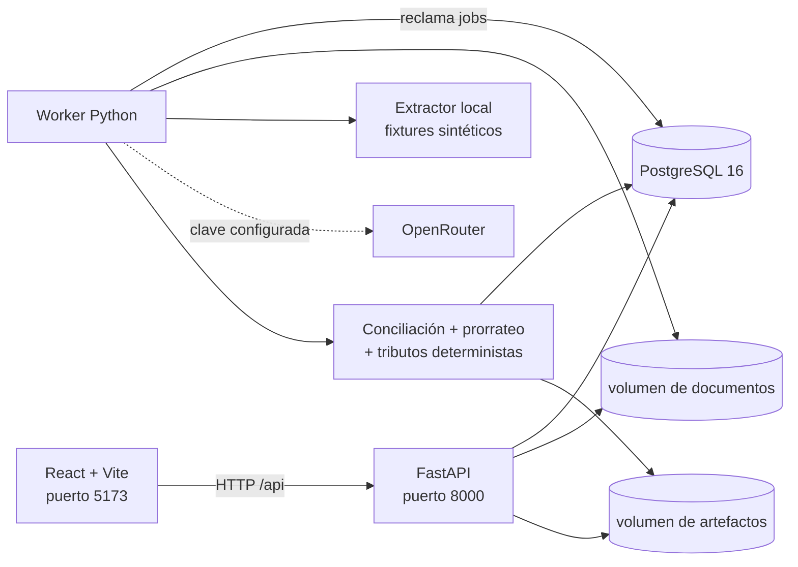

# Automatización de despachos aduaneros — demo local

Prototipo ejecutable que ingiere documentos de importación, clasifica y extrae sus datos,
los contrasta entre documentos, calcula *prorrateo*, valoración y tributos, y genera
artefactos provisionales para revisión humana. El repositorio incluye la aplicación
completa, cuatro expedientes deterministas y un pack de realismo documental; no es solo un
dataset.

> **Estado al 24 de agosto de 2026:** demo funcional para Chile, ejecutable localmente con
> Docker y validada contra fixtures sintéticos. **No está lista para producción ni para
> presentar una DIN.** El código se publica en
> `https://github.com/Clercminator/aduana`; una publicación en GitHub no equivale a un
> despliegue productivo ni elimina los pendientes SaaS detallados abajo.

## Resumen de handoff para otra LLM

Esta sección es la fuente rápida de contexto. `PROJECT_BRIEF.md` conserva el diseño y las
decisiones originales; el handoff confirmado con la agencia el 24-08-2026 lo reemplaza donde
se contradigan. Este README describe lo que existe realmente hoy y qué falta.

### Cambios confirmados con la agencia e implementados el 24-08-2026

- Una factura equivale a un parcial y a una DIN. El cálculo sigue siendo uno por B/L, pero
  `din.json` devuelve un array y `din.pdf` contiene una declaración por factura.
- Toda factura se normaliza primero a FOB según `incoterm_rules`; CIF/CFR y similares deben
  traer el desglose requerido en `included_amounts`. Si falta, la valoración se bloquea con
  una excepción crítica y nunca estima el componente.
- El seguro es configuración versionada del cliente. Falabella usa `policy_rate` de
  `0.000462`; el certificado se conserva para EXC-04 y no alimenta el cálculo. Los modos
  `certificate` y `theoretical` también están implementados; el segundo permanece bloqueado
  mientras la tasa teórica esté en `null`.
- El 115 % de CFR sigue marcado como **inferido y pendiente de confirmación**. No presentarlo
  como hecho confirmado.
- El FX chileno es dólar aduanero mensual y se valida contra el mes de aceptación de la DIN.
  La demo fija una fila mensual manual y ficticia; todavía no integra la fuente productiva.
- IVA está marcado `recoverable: true`: se paga en la vista declaración, pero se excluye del
  costo puesto. Excel expone ambas vistas por separado.
- EXC-12 compara la suma de facturas con `BillOfLading.declared_value_total`; si el B/L no
  trae ese dato queda `SKIPPED`, y si difiere el resultado es `CRITICAL`.
- Scenario C ahora contiene 45 PDFs y 40 facturas/DIN; Scenario D prueba equivalencia CIF→FOB;
  Scenario E aporta 12 plantillas de proveedor, timbres y dos PDFs de foto sin capa de texto.

### Qué ya está construido

- **Backend y persistencia:** FastAPI, Pydantic v2, SQLAlchemy 2, Alembic y PostgreSQL 16.
  Hay API y worker separados; el worker reclama trabajos persistidos y el estado sobrevive
  reinicios de los procesos.
- **Intake:** carga múltiple de PDFs, carga incremental a un despacho existente, deduplicado
  por SHA-256 dentro del despacho, almacenamiento local y cuatro escenarios precargados A/B/C/D.
- **Lectura documental:** seis tipos admitidos (instrucción, B/L, factura, packing list,
  seguro y certificado de origen), clasificación por contenido y extracción estructurada
  con valor, confianza, evidencia y página.
- **Dos backends de extracción:** `local` procesa deterministicamente los PDFs sintéticos y
  no consume un modelo; `openrouter` usa los modelos configurados. `auto` elige OpenRouter
  solo cuando existe una clave y, en caso contrario, usa el extractor local.
- **Paralelismo y telemetría:** hasta cuatro documentos en paralelo por defecto, reintentos
  del cliente ante respuestas transitorias/malformadas, tokens, costo y latencia persistidos
  por extracción y agregados por trabajo. Esa telemetría no se envía al navegador.
- **Motor determinista:** normalización, `Money` con moneda, aritmética `Decimal`, asignación
  residual reproducible, valoración, preferencia arancelaria por línea, FX y pila de
  tributos definida en YAML. Si una factura trae varias líneas, FOB, flete y seguro se
  distribuyen una sola vez entre ellas; el modelo nunca decide cálculos ni resultados de
  reglas.
- **Conciliación:** doce controles configurables, con estados `PASS`, `FAIL` o `SKIPPED` si
  faltan documentos. El certificado posterior al embarque crea riesgo, pero no cambia por
  sí solo la tasa preferencial extraída.
- **Revisión humana:** aplicación React de tres paneles con checklist esperado/recibido,
  visor PDF, citas, edición de campos con motivo obligatorio, recálculo, excepciones,
  aceptación de riesgo con justificación y trazabilidad.
- **Salidas:** Excel basado en `PRORRATEO MASTER.xlsx`, con vistas declaración/costo, y una
  DIN provisional JSON/PDF por factura. Los
  artefactos guardan hashes de contenido/configuración y los documentos fiscales llevan una
  advertencia explícita de demo.
- **Interfaz:** React 19, TypeScript, Vite, `react-pdf`, vista responsive, ayuda para la demo,
  progreso con porcentaje/tiempo, aviso persistente de entorno de demostración y el logo
  oficial IMR derivado de `logo v1.jpg` en `web/src/assets/imr-logo.png`.
- **Fixtures y pruebas:** A limpio, B con siete excepciones, C con 45 PDFs/40 facturas, D CIF
  y E de realismo documental, ground truth, pruebas unitarias/integración y Playwright.

### Arquitectura actual



El navegador infiere la API como `http(s)://<mismo-host>:8000/api`, salvo que se defina
`VITE_API_URL`. Los contenedores de API y worker comparten volúmenes de documentos y
artefactos. PostgreSQL persiste organizaciones, versiones de jurisdicción y cliente, tasas
aduaneras mensuales fijadas, despachos, documentos, ejecuciones de extracción, correcciones,
trabajos, cálculos, excepciones, eventos de auditoría y artefactos generados.

### Decisiones que no deben romperse

1. El modelo **solo lee documentos**. Reglas, dinero, tasas, asignación, redondeo y salidas
   son código determinista.
2. `jurisdictions/chile.yaml` es la autoridad de reglas nacionales; `clients/falabella.yaml`
   es la autoridad de póliza, base de asignación y defaults del cliente. Ambos hashes se fijan
   en el despacho. `peru.yaml` solo prueba generalización.
3. En modo `policy_rate`, la prima se calcula por DIN desde la tasa del cliente. La prima
   impresa no alimenta el cálculo; el certificado y el 115 % de CFR sirven para EXC-04.
4. La preferencia se determina por línea. Una anomalía del certificado puede exigir revisión
   sin reescribir silenciosamente el dato documental.
5. Cada corrección es anexada con motivo; no sobrescribir la extracción original. Conservar
   hashes, versión de prompt/esquema/configuración y eventos de auditoría.
6. Toda tabla propiedad de un cliente lleva `org_id`, aunque la demo solo inicializa una
   organización fija. No confundir esa separación de datos con autenticación implementada.
7. Los artefactos DIN deben seguir marcados `BORRADOR DEMO - NO APTO PARA PRESENTACIÓN.`
   hasta completar la validación experta y operativa descrita al final.

### Mapa del repositorio real

| Ruta | Responsabilidad |
|---|---|
| `app/api/routes.py` | Contrato HTTP, intake, consulta, correcciones, riesgo y descargas. |
| `app/jobs/` | Worker y pipeline persistido: clasificación, extracción y conciliación. |
| `app/llm/client.py` | Único acceso a OpenRouter. Ningún otro módulo debe hablar con el proveedor. |
| `app/llm/local_extract.py` | Extractor determinista exclusivo para los fixtures con capa de texto. |
| `app/schemas/domain.py` | Esquemas citados, documentos, dinero, reglas y resultados. |
| `app/engine/` | Motor determinista de dinero, asignación, valoración, tributos, FX y reglas. |
| `app/adapters/` | Excel de prorrateo y DIN provisional JSON/PDF. |
| `app/db/` + `migrations/` | Modelos SQLAlchemy, sesión y esquema Alembic inicial. |
| `jurisdictions/` | Configuración Chile y fixture de generalización Perú. |
| `clients/` | Perfiles de cliente versionados; hoy Falabella y su póliza 2026. |
| `web/src/` | SPA React: intake, progreso, revisión, PDF, excepciones y cálculos. |
| `web/tests/` | Playwright end-to-end contra la pila Docker. |
| `fixtures/` | Escenarios A/B/C/D, pack E, ground truth y respuesta financiera esperada. |
| `scripts/` | Reset, reporte y regeneración determinista de answer key y fixtures C/D/E. |
| `docs/GUIA_DEMO_7_MINUTOS.md` | Guion comercial honesto y límites que deben comunicarse. |
| `PROJECT_BRIEF.md` | Especificación de arquitectura, dominio y alcance original. |

### Contrato HTTP implementado

| Método y ruta | Uso |
|---|---|
| `GET /api/health` | Healthcheck. |
| `POST /api/intake/batches` | Crear despacho desde una carga multipart y encolar trabajo. |
| `POST /api/demo/load/{A\|B\|C\|D}` | Cargar un escenario sintético y encolar trabajo. |
| `POST /api/dispatches/{id}/documents` | Agregar documentos y reprocesar. |
| `GET /api/jobs/{id}` | Estado, etapa, progreso, error y tiempo transcurrido. |
| `GET /api/dispatches/{id}` | Estado efectivo completo para revisión. |
| `POST /api/dispatches/{id}/run` | Reencolar el procesamiento del despacho. |
| `PATCH /api/dispatches/{id}/fields/{path}` | Anexar corrección con valor y motivo. |
| `POST /api/exceptions/{id}/accept-risk` | Registrar aceptación de demo con justificación. |
| `GET /api/documents/{id}/file` | Servir el PDF guardado. |
| `GET /api/dispatches/{id}/exports/reconciliation.xlsx` | Descargar Excel de conciliación. |
| `GET /api/dispatches/{id}/exports/din.json` | Descargar DIN provisional estructurada. |
| `GET /api/dispatches/{id}/exports/din.pdf` | Descargar resumen DIN provisional. |

FastAPI publica además OpenAPI/Swagger en `/docs`. El contrato actual no tiene login,
sesiones, roles ni autorización por usuario; se limita a la organización demo fija.

### Configuración

`.env.example` contiene valores seguros de demostración. `.env` está ignorado por Git y no
debe copiarse a documentación ni compartirse con una LLM.

| Variable | Función / valor de demo |
|---|---|
| `DATABASE_URL` | Conexión PostgreSQL. |
| `EXTRACTION_BACKEND` | `auto`, `local` u `openrouter`. |
| `OPENROUTER_API_KEY` | Secreto opcional; vacío permite la demo local. |
| `CLASSIFY_MODEL` / `EXTRACT_MODEL` | Modelos fijados para cada etapa; no hay fallback silencioso. |
| `EXTRACT_MAX_TOKENS` | Techo de salida para extracción, 12.000 por defecto. |
| `DOCUMENT_CONCURRENCY` | Paralelismo por trabajo, 4 por defecto y máximo 12. |
| `DOCUMENT_ROOT` / `ARTIFACT_ROOT` | Almacenamiento persistente de entrada y salidas. |
| `FIXTURE_ROOT` / `JURISDICTION_ROOT` / `CLIENT_ROOT` | Fixtures y YAML versionados. |
| `CORS_ORIGINS` | Orígenes autorizados del frontend local. |
| `DEMO_FX_RATE` / `DEMO_FX_SOURCE` / `DEMO_FX_DATE` | Dólar aduanero mensual ficticio. |
| `DEMO_DIN_ACCEPTANCE_DATE` | Fecha usada para validar que el FX pertenece al mes correcto. |
| `VITE_API_URL` | Override opcional del frontend; no está en la configuración Python. |

### Diagnóstico de preparación SaaS — revisión integral del 24-08-2026

Este diagnóstico revisó el árbol completo y el cambio financiero/de despliegue, no solo la
interfaz. **Corregido** significa cubierto por código y pruebas sintéticas; no significa
validación legal, aduanera ni productiva.

**Corregido en esta revisión — exactitud financiera**

- Se eliminó el doble conteo cuando una factura tiene varias líneas. Antes, valor aduanero,
  tributos y costo puesto repetían importes de cabecera por cada línea: al dividir una
  factura válida en dos, los tributos pasaban de USD 11.063,88 a USD 14.805,48 y el costo
  puesto de USD 58.230,93 a USD 77.923,57. Ahora el motor asigna los importes de factura a
  sus líneas con residual determinista y conserva exactamente los totales originales.
- Excel, las vistas declaración/costo y el número de DIN agregan por factura única. Una
  factura multilínea produce varias líneas de cálculo, pero una sola fila operativa y una
  sola DIN.
- Total, moneda de factura, total de línea y flete/moneda del B/L dejaron de asumir cero o
  USD silenciosamente. La ausencia o invalidez bloquea el cálculo con `VAL-03`, respetando
  la regla de nunca estimar un dato financiero obligatorio.
- La tasa preferencial ya no toma el primer acuerdo configurado. Busca código, etiqueta o
  `aliases` versionados en el YAML de la jurisdicción; una etiqueta documental desconocida
  aplica la tasa general y deja una razón auditable.
- El total de derechos suma todas las tasas `hs_lookup`; las comparaciones de impacto ya no
  dependen de que el primer gravamen o acuerdo del YAML sea el relevante.
- Tasas, tolerancias, cobertura y póliza tienen límites de esquema razonables. Configuraciones
  negativas, superiores a 100 % o estructuralmente incompletas se rechazan al cargar.
- Monedas y nombres de gravámenes visibles se derivan del cálculo/configuración. La tabla ya
  no presupone exclusivamente USD, CLP, IVA ni dos tributos.

**Corregido en esta revisión — despliegue y QA**

- El arranque Docker dejó de fallar al persistir una fecha YAML (`effective_from`) en JSONB:
  toda configuración validada se serializa ahora en modo JSON antes de versionarse.
- Se probó desde cero la migración, healthcheck, API, worker, PostgreSQL, almacenamiento y
  frontend. El E2E real cubre carga múltiple, A/B, corrección, aceptación de riesgo,
  descargas, expediente incompleto y Scenario C de 40 facturas.
- `docker-compose.e2e.yml` fuerza el extractor local solo para QA. Así la prueba de
  infraestructura es determinista, no consume el proveedor y no confunde latencia externa
  con un defecto del producto. La pila normal conserva `auto`/`openrouter`.
- Playwright usa un worker porque la suite comparte una cola y una base. Paralelizar archivos
  de prueba contra un único worker de aplicación introducía esperas artificiales.

**P0 SaaS aún abierto — aislamiento y confianza**

- `org_id` existe en las tablas, pero no hay identidad, sesión, roles ni middleware de
  autorización; varios endpoints obtienen recursos por UUID sin demostrar pertenencia a la
  organización. Hace falta aislamiento tenant por consulta, pruebas de acceso cruzado y,
  preferiblemente, defensa adicional en PostgreSQL antes de alojar varias agencias.
- La organización, Chile, Falabella y los documentos esperados se inicializan para la demo.
  El perfil de cliente no declara todavía a qué organización pertenece y el almacenamiento
  usa raíces globales. Onboarding, configuración, cuotas y namespaces deben ser por tenant.
- La aceptación de riesgo registra justificación, pero no un actor autenticado. Correcciones,
  aprobaciones, descargas y eventos necesitan identidad verificable y permisos por rol.
- No existe aún política implementada de retención/borrado, cifrado administrado, secretos,
  backups/restauración, auditoría operativa ni respuesta a incidentes para documentos
  comerciales sensibles.

**P0/P1 SaaS aún abierto — generalización funcional**

- Las rutas de demo eligen siempre Chile/DIN y la interfaz aún conserva lenguaje propio del
  flujo chileno. `declaration.adapter` y el perfil de cliente deben seleccionar realmente
  adaptadores, reglas, plantillas y copy por tenant/jurisdicción. `peru.yaml` prueba el motor
  de gravámenes, pero no existe `pe_dua` productivo.
- `PRORRATEO MASTER.xlsx` es una plantilla global y la regla una-factura/una-DIN aún es una
  decisión del demo, no una política configurable por agencia, régimen o cliente.
- `default_incoterm`, `transport_document`, `allocation.cost_lines`, `fx.date_rule` y parte
  del contrato de adaptadores están modelados pero no gobiernan todo el flujo. Cada campo
  configurado debe tener consumidor, test contractual o eliminarse para evitar falsa
  configurabilidad.
- El modelo de FX persiste año/mes; una jurisdicción declarada como `daily` no puede representar
  correctamente tasas diarias. Hay que modelar período/fecha efectiva, unicidad y selección
  según `date_rule`, además de una fuente productiva versionada.
- El mapeo de declaración, campos obligatorios, fórmulas y documentos esperados requieren
  catálogos versionados por jurisdicción/régimen y validación experta. No asumir que un YAML
  ilustrativo convierte la solución en multi-país.

**P1 SaaS aún abierto — datos, escala y operación**

- La migración inicial llama dinámicamente a `Base.metadata.create_all`; no es un historial
  DDL inmutable. Sustituirla por operaciones Alembic explícitas y probar upgrade desde base
  vacía, upgrade incremental y compatibilidad/rollback definido.
- La carga no impone todavía tamaño máximo total/por archivo, cuota tenant, límite de páginas,
  antivirus, backpressure ni deduplicación global segura. También faltan política de reintento,
  dead-letter, cancelación, idempotencia bajo fallos y recuperación visible al operador.
- `DOCUMENT_CONCURRENCY` limita documentos dentro de un trabajo, pero un único worker no es
  una arquitectura de escala horizontal. Medir múltiples despachos, locking, prioridades,
  cuotas del proveedor, 429, costo y throughput antes de prometer capacidad.
- Faltan SLO/SLI, métricas, trazas correlacionadas, alertas, panel de uso/costo, healthchecks
  de dependencias profundas y runbooks de backup, restauración y trabajos atascados.
- El frontend necesita accesibilidad y manejo de estados de error/red/archivos grandes más
  exhaustivos; el QA actual valida el camino comercial y responsive principal, no toda la
  matriz de navegadores ni sesiones largas.

**P2 comercial/plataforma aún abierto**

- Onboarding autoservicio, invitaciones, branding por agencia, administración de usuarios,
  planes, medición de consumo, facturación, soporte, analítica y límites de plan no existen.
- El proveedor/modelo, prompts, precisión por campo y costo necesitan un set de evaluación
  versionado y gates de regresión. No exponer cifras de precisión, ahorro o SLA hasta medirlas
  con expedientes reales anonimizados y revisión humana autorizada.

Orden recomendado para convertirlo en producto: (1) validación experta y contrato de datos,
(2) identidad/aislamiento tenant, (3) migraciones/operación segura, (4) configuración real por
agencia y jurisdicción, (5) evaluación y escala, y recién después (6) billing/onboarding.

### Qué falta — prioridades explícitas

**Pendientes de dominio conservados del handoff de la agencia**

- Confirmar que `coverage_pct: 1.15` es efectivamente la base de la tasa 0,0462 %; hoy se
  conserva como inferencia de `PRORRATEO MASTER`.
- Obtener la tasa de seguro teórico cuando aparezca un caso sin póliza.
- Definir plazos/documentos para devolución después de pagar 6 % y recibir un CoO corregido;
  es backlog, no v1.
- Tratar exportaciones (30 % del volumen informado) y otros regímenes en conversaciones de
  alcance separadas; v1 sigue siendo importación chilena para consumo.
- Confirmar qué otros costos se prorratean y medir tiempo humano por despacho para cualquier
  argumento de ROI. No inventar esas cifras.

**P0, bloquea cualquier piloto con documentos reales o producción**

- Validación escrita de un experto aduanero chileno sobre valoración, preferencia, tasas,
  tolerancias, redondeos, doce controles, campos obligatorios y salidas.
- Evaluación de extracción con documentos reales anonimizados: escaneos, fotos, sellos,
  rotaciones, anotaciones, OCR y casos de baja confianza. El extractor local rechaza PDFs
  escaneados; OpenRouter puede recibirlos, pero esa ruta aún no prueba precisión real.
- Definir privacidad, base legal/contratos, residencia y retención de datos, borrado,
  cifrado, backups, restauración, gestión de secretos y términos del proveedor. No cargar
  documentación real antes de aprobarlo.
- Implementar identidad, autenticación, autorización por rol y aislamiento de organización
  verificable en API. `org_id` es solo el seam de datos, no un control de acceso completo.
- Sustituir la fila mensual ficticia por el ingreso/fuente productiva del dólar aduanero.
- Confirmar la base `coverage_pct: 1.15` y obtener la tasa de seguro teórico antes de habilitar
  ese modo. Ambas incertidumbres permanecen explícitas en configuración/answer key.
- Completar y validar el mapeo DIN. El PDF actual es un resumen de revisión, no un formulario
  oficial y no existe presentación, pago ni transmisión a Aduanas.
- Diseñar despliegue productivo, HTTPS, dominios, observabilidad, alertas, backups y plan de
  recuperación. Hoy está probada la ejecución local por Docker, no un entorno productivo.
- Establecer versionado semántico, CI protegida, releases reproducibles y procedencia de
  imágenes. El repositorio publicado es solo el punto de partida.

**P1, antes de prometer capacidad o confiabilidad operativa**

- Load test con múltiples despachos simultáneos; escenario C prueba un despacho de 45 PDFs,
  no una cola de cientos. Medir cuotas, 429, latencia, costo, reintentos y límites del worker.
- Definir recuperación operativa de trabajos fallidos, reintentos manuales/automáticos,
  idempotencia bajo fallos parciales y políticas de dead-letter/alerta.
- Crear un set de evaluación versionado para modelos y prompts, con umbrales por tipo/campo,
  regresión al cambiar modelo y revisión de citas.
- Ampliar QA de navegador, accesibilidad y responsive con datos grandes, archivos inválidos,
  red lenta, errores del proveedor y sesiones largas. El flujo principal sí tiene E2E.
- Decidir si costos/tokens necesitan panel de operador; hoy solo existe
  `scripts/report_usage.py` y la persistencia en PostgreSQL.

**Diferido deliberadamente / fuera del prototipo**

- Inferir códigos HS desde descripciones; regímenes especiales; múltiples monedas por B/L;
  varios B/L o despachos parciales; UI multi-organización.
- Integraciones directas con Aduanas, transportistas/forwarders, EDI, pagos, presentación o
  acciones ejecutadas en nombre del usuario.
- Soporte productivo para Perú. `peru.yaml` únicamente demuestra que la pila de tributos es
  configurable.

Los seams ya existentes para trabajo futuro son `Cited.provenance`, `dispatch.regime`, el
objeto `Money`, el scope explícito de `allocate()`, `org_id` y los adaptadores de declaración.
No presentar esos seams como funcionalidades terminadas.

## Ejecutar la demo

Requisitos: Docker Desktop con motor Linux. No se necesita una clave de modelo para los
fixtures: el modo local extrae deterministicamente los PDFs sintéticos. Desde la raíz:

```powershell
docker compose up --build -d
```

Abra [http://localhost:5173](http://localhost:5173). La API y su documentación quedan en
[http://localhost:8000/docs](http://localhost:8000/docs). Para permitir acceso por LAN use
la IP privada del equipo; la interfaz resuelve la API en el mismo host y puerto 8000.
El botón **Ayuda** de la barra superior abre una guía breve para conducir la demostración.

Para el E2E reproducible use un nombre de proyecto aislado y el override local. Esto crea
volúmenes QA independientes y evita consumir OpenRouter aunque exista una clave en `.env`:

```powershell
docker compose -p aduanaqa -f docker-compose.yml -f docker-compose.e2e.yml up -d --build
cd web
npm run test:e2e
cd ..
docker compose -p aduanaqa -f docker-compose.yml -f docker-compose.e2e.yml down -v
```

### Por qué tarda ese tiempo y no más o menos

En modo OpenRouter cada PDF puede requerir dos solicitudes externas: clasificación basada
en contenido y extracción estructurada con citas. Esas tareas de red y modelo se ejecutan
ahora con **cuatro documentos en paralelo** (`DOCUMENT_CONCURRENCY=4`). Las escrituras en
base de datos, la conciliación, el prorrateo y los tributos siguen siendo secuenciales y
deterministas, para que el resultado no dependa del orden en que respondan los modelos.

Mediciones reales en este equipo el 20 de agosto de 2026:

| Escenario | PDFs | Tiempo | Rendimiento | Tokens internos | Costo interno |
|---|---:|---:|---:|---:|---:|
| A, limpio | 8 | **26,9 s** | 17,9 PDFs/min | 61.677 | USD 0,04359965 |
| C anterior, 24 facturas | 29 | **150,8 s** | 11,5 PDFs/min | 256.672 | USD 0,19507495 |

Antes de paralelizar, una ejecución comparable del escenario A tardó 108,3 segundos. El
nuevo tiempo de 26,9 segundos representa una reducción observada del **75,2 %**. Son
mediciones de referencia, no un SLA: incluso con los mismos archivos el proveedor puede
cambiar de región, carga y velocidad.

Esa medición corresponde al fixture anterior de 24 facturas. El Scenario C actual contiene
40 facturas/45 PDFs y todavía no tiene una medición OpenRouter comparable. Los documentos
consolidados de packing y origen generan respuestas JSON mayores que una factura de una línea.
También puede tardar más por cola del proveedor, respuestas transitorias, `Retry-After`, OCR
o documentos extensos. Puede tardar menos si el proveedor responde más rápido, si se
reutilizan extracciones ya persistidas o en modo local. Subir la concurrencia puede reducir
el tiempo, pero aumenta la probabilidad de límites 429 y debe medirse con la cuenta y modelos
reales; cuatro es el valor conservador probado para la demo.

Respuesta breve para una demostración:

> “Los PDFs se leen en paralelo, con evidencia por campo. En esta prueba, ocho documentos
> bajaron de 108 a 27 segundos; una versión anterior de volumen procesó 29 PDFs en 2 minutos
> y 31 segundos. El fixture actual de 45 PDFs aún debe medirse con OpenRouter. La variación
> viene del proveedor y del tamaño de cada documento; los
> controles y cálculos posteriores son deterministas.”

La interfaz del usuario muestra únicamente porcentaje y tiempo transcurrido. Tokens y costo
son telemetría interna para capacidad, márgenes y alertas; no forman parte de la experiencia
ni del precio mensual que eventualmente vea el cliente. El endpoint de progreso tampoco
envía esos campos al navegador. Para revisar las últimas ejecuciones:

```powershell
docker compose exec -T api python scripts/report_usage.py --limit 10
```

El detalle también permanece persistido por ejecución de extracción y por trabajo en
PostgreSQL. Nunca exponga la clave de OpenRouter ni respuestas crudas al cliente.

Para usar OpenRouter, copie `.env.example` a `.env`, agregue `OPENROUTER_API_KEY` y cambie
`EXTRACTION_BACKEND=openrouter`. Los modelos por defecto son
`google/gemini-3.7-flash` para extracción y `google/gemini-3.5-flash-lite` para
clasificación; no hay cambio silencioso de modelo durante una ejecución. La concurrencia se
configura con `DOCUMENT_CONCURRENCY` y el techo de salida para documentos largos con
`EXTRACT_MAX_TOKENS`. No cargue
documentos reales hasta aprobar privacidad, retención y condiciones del proveedor.

### Última verificación conocida

Ejecutada el **24 de agosto de 2026** después de implementar los cambios confirmados:

| Comprobación | Resultado |
|---|---|
| `python -m pytest -q` | **PASS — 44 pruebas**. Incluye cifras A/B, factura multilínea sin doble conteo, datos financieros obligatorios, selección/alias de acuerdos, EXC-12, CIF, FX mensual, seguro, realismo documental y artefactos. |
| `ruff check app tests migrations scripts` | **PASS — sin hallazgos**. |
| `npm run lint` | **PASS**. |
| `npm run build` | **PASS — 1.849 módulos transformados**. |
| Playwright de paginación | **PASS** en Chromium, 1536×1024 y 390×844 con API simulada: 40 DIN únicas aunque existan 41 líneas, página 2 correcta y sin errores de consola. |
| Render PDF | **PASS** por inspección con `pypdfium2`: Scenario C generó 40 páginas; primera y última DIN legibles, completas y con advertencia de borrador. |
| `docker compose ... config --quiet` | **PASS** para la pila normal y el override E2E; perfiles y volúmenes compartidos están montados en API/worker. |
| `npm run test:e2e` completo | **PASS — 4 recorridos en 18,3 s** contra API, worker, PostgreSQL y volúmenes Docker nuevos con extractor local determinista. |
| Dependencias | **PASS** — `pip check` sin dependencias rotas y `npm audit` con 0 vulnerabilidades. |

El plugin Browser no estaba disponible; el QA visual usó el Playwright instalado en `web/`.
Se inspeccionaron las capturas desktop/móvil/completo-incompleto y las páginas 1/40 de la
DIN. Los artefactos temporales no se agregaron al repositorio. El test real contra Scenario C
permanece en `web/tests/workflow.spec.ts`; el test aislado de factura multilínea/paginación
está en `web/tests/pagination.mock.spec.ts`.

Comandos de verificación reproducibles:

```powershell
.\.venv\Scripts\python -m pytest -q
.\.venv\Scripts\ruff check app tests migrations scripts
cd web
npm run lint
npm run build
npm audit --audit-level=high
```

El E2E requiere primero la pila aislada mostrada en la sección de ejecución.

Restablezca todos los despachos de la organización demo, sin borrar la configuración:

```powershell
docker compose exec -T api python scripts/reset_demo.py
```

## Implementación

- FastAPI, Pydantic v2, SQLAlchemy 2, Alembic y PostgreSQL 16, con un worker separado.
- Almacenamiento local direccionado por SHA-256, ejecuciones de extracción y cálculo
  inmutables, correcciones anexadas y eventos de auditoría.
- React 19, TypeScript, Vite y `react-pdf`, con carga de carpeta/archivos, progreso en vivo,
  revisión en tres paneles, checklist esperado-versus-recibido, citas, correcciones,
  controles pendientes por documentos faltantes y aceptación escrita de riesgo de demo.
- Motor con `Decimal`, normalización a FOB, asignación residual determinista, expresiones de
  tributos con AST restringido, preferencia por línea, FX mensual y doce reglas configurables.
- Exportación del prorrateo basada en `PRORRATEO MASTER.xlsx`: conserva sus dos hojas
  operativas, calcula la prima desde el perfil de cliente, agrega tasa de derecho por línea y
  añade Resumen, Documentos, Extracciones, Validaciones, Prorrateo, Tributos, Vista
  declaración, Vista costo y Trazabilidad. La copia registra SHA-256 de plantilla,
  jurisdicción, cliente y cálculo reproducible, y admite hasta 100 facturas.
- Una DIN provisional por factura en JSON y PDF con una advertencia que impide confundirla con una
  declaración lista para presentar. La interfaz general usa una indicación más discreta de
  entorno de demostración y el Excel señala que la validación aduanera está pendiente.

Four dispatches, all synthetic Chile imports from China for the same importer:

| | Scenario A | Scenario B | Scenario C | Scenario D |
|---|---|---|---|---|
| Folder | `scenario_A_clean/` | `scenario_B_exceptions/` | `scenario_C_volume/` | `scenario_D_cif/` |
| PDFs | 8 | 8 | 45 | 6 |
| Despacho | 700611 | 700612 | 700613 | 700614 |
| Outcome | 3 DIN, 12 checks pass | 3 critical + 4 warnings | 40 DIN, 12 checks pass | CIF→FOB, 12 checks pass |
| Purpose | Happy path | Detection/impact | Volume/pagination | Incoterm normalization |

`scenario_E_document_realism/` no es un despacho coherente: es un pack separado de 12
formatos de proveedor, dos certificados de origen y dos fotos sin capa de texto para QA de
documentos/OCR.

Every document carries a footer marking it as synthetic. Nothing here is a real shipment.

---

## Acronyms used throughout

- **B/L** — Bill of Lading. The carrier's transport document; receipt, contract of carriage and document of title.
- **FOB** — Free On Board. Goods value at the port of origin, seller's cost up to the ship's rail.
- **CFR** — Cost and Freight. FOB plus ocean freight.
- **CIF** — Cost, Insurance and Freight. FOB + freight + insurance. This is the customs valuation base in Chile.
- **CoO** — Certificate of Origin. Evidence the goods originate in a country with a trade agreement.
- **FTA / TLC** — Free Trade Agreement / *Tratado de Libre Comercio*.
- **HS code** — Harmonized System code, the international tariff classification (*partida arancelaria*).
- **IVA** — *Impuesto al Valor Agregado*, Chilean VAT, 19%.
- **DIN** — *Declaración de Ingreso*, the Chilean import declaration filed with Servicio Nacional de Aduanas.
- **Parcial** — En el vocabulario confirmado de esta agencia: una factura y, por tanto, una
  DIN. No significa despacho parcial desde almacén particular en este alcance.
- **Prorrateo** — pro-rata allocation of freight and insurance across the invoices on one B/L.

---

## Uploaded files

Scenarios A and B contain one dispatch instruction plus seven expected shipment files. The
instruction seeds the checklist; it is not counted among the seven documents expected from
the carrier, supplier and insurer. Scenario C contains 40 commercial invoices: 45 uploaded
PDFs in total and 44 expected shipment documents.

| # | File | Role in the process | Who issues it |
|---|---|---|---|
| 00 | Instrucción de Despacho | Importer's order to the customs agency. Carries the despacho number, the reference, and the standing instructions (prorrate by value, invoke the FTA). | Importer |
| 01 | Bill of Lading | Freight amount, gross weight, package count, consignee, invoice references. The freight figure is the input to the whole prorrateo. | Carrier |
| 02 | Commercial invoices (×3) | FOB value, HS code, quantities, unit prices. One B/L, several invoices — this is exactly why a prorrateo exists. | Supplier |
| 03 | Packing List | Weights and package counts per invoice. The cross-check against the B/L. | Supplier |
| 04 | Certificado de Seguro | Sum insured and premium. The premium is a CIF component. | Insurer |
| 05 | Certificate of Origin | Determines whether duty is 0% or 6%. The single largest money lever in the file. | Chinese certifying authority (CCPIT) |

---

## The pipeline the prototype should walk through

1. **Intake** — drop the whole folder in. No sorting, no naming convention required.
2. **Classification** — identify what each file is. The demo folders are deliberately named so you can *verify* the classifier, not feed it.
3. **Extraction** — structured fields out of each document type, each field carrying a source reference (file + page) so a human can click back to the original.
4. **Reconciliation** — the eleven cross-checks listed in `ANSWER_KEY.json`. This is the part a spreadsheet cannot do.
5. **Duty determination** — per line, driven by the CoO coverage, not a single global cell.
6. **Prorrateo** — freight and insurance allocated by invoice value; CIF, duty and IVA built per line.
7. **Output** — DIN draft, the cash-to-wire figure, and an exception queue with a suggested action per item.

Stages 4–7 should be **deterministic code**, not the model. The model reads documents;
arithmetic and rule-checking are ordinary functions. That is what makes the output
auditable and what keeps the cost per dispatch in cents.

---

## Scenario A — the clean run

Ningbo Homeware → Falabella Retail S.A., 1×40'HC Shanghai→Valparaíso, 962 cartons, 14,820 kg.
Three invoices totalling USD 55,000 FOB, freight USD 3,200.

All eleven checks pass. CoO covers all three HS codes, so the China–Chile FTA gives 0% duty.

| | USD |
|---|---|
| FOB | 55,000.00 |
| Freight | 3,200.00 |
| Insurance premium | 38.66 |
| **CIF** | **58,238.66** |
| Duty (FTA preference, 0%) | 0.00 |
| IVA 19% | 11,065.35 |
| **To Tesorería** | **11,065.35** (~CLP 10,660,911) |

**Talking point:** without the origin preference this shipment would owe USD 3,494.33 duty
and USD 11,729.26 IVA — **USD 4,158.24 more**. On one container. The current spreadsheet
hardcodes a single 6% duty rate in one cell for the whole B/L, so it cannot express this.

---

## Scenario B — the exception run

Shenzhen Brightpath → Falabella, 1×40'HC Ningbo→Valparaíso. Three invoices, USD 64,370 FOB,
freight USD 4,150. Seven planted defects, none of them visible from any single document:

| ID | Severity | What's wrong |
|---|---|---|
| EXC-01 | CRITICAL | Packing list says 9,847 kg; B/L says 9,208 kg. 639 kg / 6.9% apart. |
| EXC-02 | CRITICAL | B/L cites invoice BN26010515. No such invoice — the set has BN26010514. |
| EXC-03 | CRITICAL | CoO covers HS 9405.20 and 8518.22 only. HS 8544.42 (USD 9,120) gets no preference. |
| EXC-04 | WARNING | Insured for USD 68,000; 115% of CFR requires USD 78,798. Shortfall USD 10,798. |
| EXC-05 | WARNING | Invoice BN26010513: 2,600 × USD 12.50 = 32,500, but the invoice totals 33,800. |
| EXC-06 | WARNING | B/L and CoO say *Falabella Retail S.A.*; the invoices say *Falabella Retail SpA*. |
| EXC-07 | WARNING | CoO issued 2026-07-28, vessel sailed 2026-07-14, with no retrospective annotation. |

**The money, three ways:**

| Treatment | Duty | IVA | Total |
|---|---|---|---|
| Correct per documents (line 3 at 6%) | 582.79 | 13,136.46 | **13,719.25** |
| Blanket 0% because "there's a CoO" | 0.00 | 13,025.72 | 13,025.72 |
| Preference rejected outright (EXC-07 risk) | 4,113.38 | 13,807.26 | 17,920.64 |

Under-declaring by USD 693.52 is a fine plus interest. The EXC-07 exposure is USD 4,201.39
of unbudgeted cash at the port. Both are invisible to anyone reading one document at a time.

**Talking point:** EXC-01, EXC-02 and EXC-03 each require *two* documents to detect.
No amount of careful reading of the invoice alone finds them. That is the difference between
an extraction tool and a system.

---

## Scenario C — volume and parallel processing

This coherent synthetic dispatch contains 45 PDFs: one instruction, one B/L, 40 commercial
invoices, one packing list, one insurance certificate and one certificate of origin. All
invoice references, weights, packages, HS coverage and totals reconcile; all twelve controls
pass. The current 45-PDF fixture has not yet had a full OpenRouter timing run; do not reuse the
150,8-second result from the earlier 29-PDF version as though it measured this set.

Recommended meeting flow:

1. Show the folder and state that it contains 40 invoices plus the consolidated documents.
2. Ask the customs team how long this specific volume would take them to classify,
   transcribe, cross-check and prorrate. Let them provide the baseline; do not invent it.
3. Start **Escenario C · 45 PDFs** and leave the percentage/time screen visible.
4. When it finishes, show 45/45 documents, citations, 12/12 conforming controls, prorrateo
   and the completed familiar workbook.
5. Then run scenario B to prove the system is not merely copying values: it also finds
   contradictions between documents.

Regenerate the volume fixture deterministically with:

```powershell
.\.venv\Scripts\python scripts\generate_volume_fixture.py
```

---

## Jurisdiction configs

`jurisdictions/chile.yaml` is the shipped target. `jurisdictions/peru.yaml` exists only to
prove the engine generalises — four levies with a cascading base, produced by the same code
with no changes. It is a test fixture, never a supported product.

All figures in the answer key are computed through the config-driven levy engine. Nothing
about Chile is hardcoded. The CLP figures use a clearly fictional demo FX rate of
963.45 CLP/USD; production reads the configured source on the configured date rule.

## `ANSWER_KEY.json`

The ground truth: every expected field, the full per-line prorrateo, and the expected verdict
on all eleven checks for both dispatches. Use it two ways:

- **During build** — as the test fixture. The prototype should reproduce these numbers exactly.
- **In the meeting** — as the honest scorecard. Run it live, then show what it was supposed to
  find. If it misses one, say so. Credibility here is worth more than a perfect demo.

---

## What this dataset deliberately does *not* prove

- Extraction accuracy on **real** scans — these PDFs are digitally generated and clean.
  Photographed, stamped, skewed and handwritten-annotated documents are materially harder,
  and that is the single biggest unknown before a real pilot.
- **HS classification** — every HS code here is given on the invoice. Proposing a code from a
  product description is a separate, riskier capability and should stay suggest-and-approve.
- **Fleet-scale throughput** — scenario C proves one 29-PDF dispatch, not a queue of two
  hundred simultaneous dispatches. Worker scaling and provider quotas still require a load
  test before making a capacity claim.

## Provisional fiscal notice

This repository is an automation demo, not a filing system. Falabella's annual policy rate
is used as the insurance component; the printed certificate premium is evidence only, and
115% of CFR is a separate coverage control whose base remains pending confirmation. Fiscal
rules, the productive FX ingestion and DIN mapping require validation before real-world use.
Generated DIN artifacts must display
`BORRADOR DEMO - NO APTO PARA PRESENTACIÓN.`

### Cuándo se puede quitar esa advertencia

No debe quitarse del DIN solo para mejorar la presentación comercial. Se puede reemplazar
por un estado operativo normal cuando, como mínimo:

1. Un experto aduanero chileno haya validado por escrito valoración, preferencias, tasas,
   tolerancias, redondeos y los doce controles contra casos reales anonimizados.
2. El mapeo incluya todos los campos, códigos, formatos y validaciones obligatorios de la DIN
   aplicable; el PDF actual es un resumen de revisión, no un formulario oficial.
3. El dólar aduanero mensual provenga de la fuente operativa aprobada y esté fijado al mes de
   aceptación de la DIN, no a la fila ficticia del demo.
4. La extracción haya superado una evaluación acordada sobre documentos reales escaneados y
   OCR, incluyendo recuperación de fallos y revisión humana de baja confianza.
5. Existan privacidad, retención, seguridad, roles, respaldo, auditoría y aprobación humana
   adecuados para documentos reales.
6. El agente de aduanas responsable haya aprobado la salida y el procedimiento de uso. Si el
   objetivo es presentación electrónica directa, también falta construir y certificar esa
   integración.

Hasta entonces, el producto puede mostrarse como automatización de preparación y revisión,
pero ningún artefacto DIN debe parecer autorizado para presentación.
